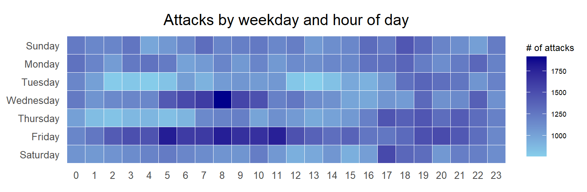
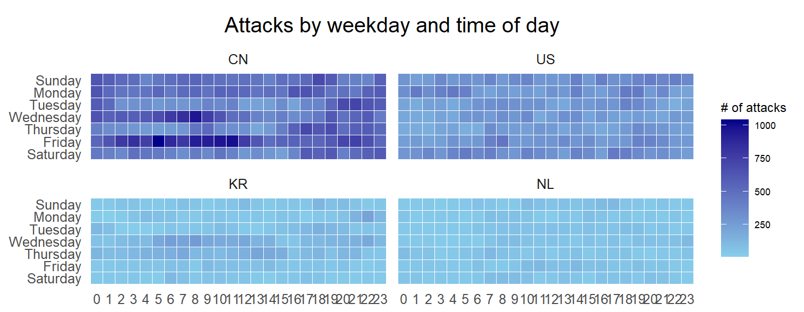
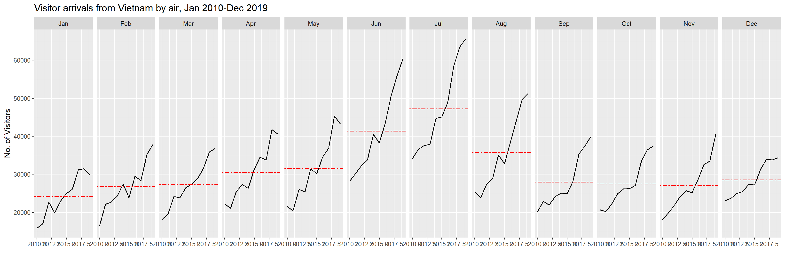
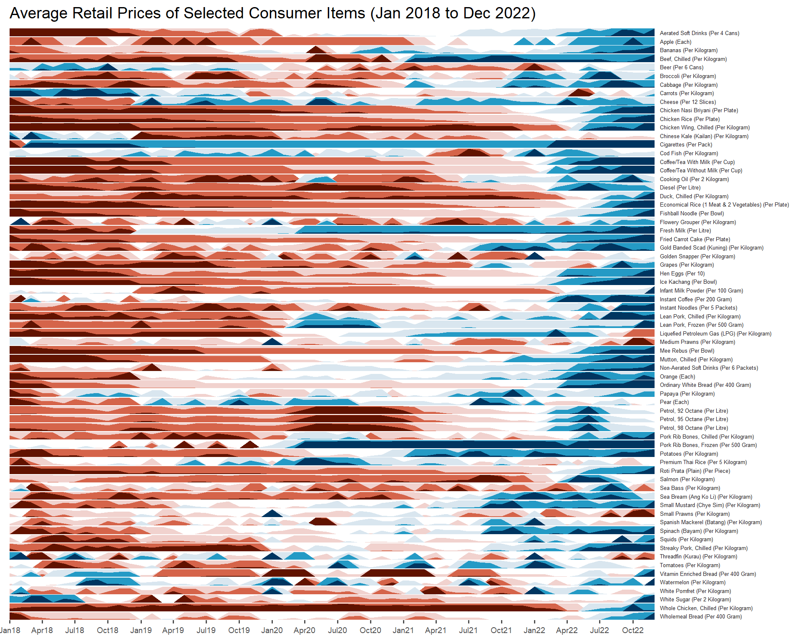

# **7.1 Learning Outcome**

In this hands-on exercise, we will create the following data visualizations using R packages:

-   A calendar heatmap using ggplot2 functions
-   A cycle plot using ggplot2 functions
-   A slopegraph
-   A horizon chart

# **7.2 Getting Started**

The below code chunk is used to check, install and launch the following R packages

```{r}
pacman::p_load(scales, viridis, lubridate, ggthemes, 
               gridExtra, readxl, knitr, data.table, 
               CGPfunctions, ggHoriPlot, tidyverse)
```

# **7.3 Plotting Calendar Heatmap**

In this section, we will learn how to plot a calender heatmap programmatically.



By the end of this section, we will be able to:

-   Create a calendar heatmap using ggplot2 functions and extensions
-   Extract specific date and time-related fields using **base R** and the **lubridate** package
-   Perform data preparation tasks using the **tidyr** and **dplyr** packages

## **7.3.1 The Data**

This hands-on exercise will utilize the *eventlog.csv* file, which includes 199,999 rows of time-stamped cyber attack data categorized by country.

## **7.3.2 Importing the data**

```{r}
attacks <- read_csv("data/eventlog.csv")
```

## **7.3.3 Examining the data structure**

It's always a good practice to examine the data frame before analysis. So, we use **kable()** to review its structure.

```{r}
kable(head(attacks))
```

::: callout-note
## Observations

1.  There are three columns, namely *timestamp*, *source_country* and *tz*.
2.  *timestamp* field stores date-time values in POSIXct format.
3.  *source_country* field stores the source of the attack. It is in *ISO 3166-1 alpha-2* country code.
4.  *tz* field stores time zone of the source IP address.
:::

## **7.3.4 Data Preparation**

**Step 1: Deriving Weekday & Hour Fields**

Before plotting the calendar heatmap, we need to create **wkday** and **hour** fields. This step involves writing a function to generate them.

```{r}
make_hr_wkday <- function(ts, sc, tz) {
  real_times <- ymd_hms(ts, 
                        tz = tz[1], 
                        quiet = TRUE)
  dt <- data.table(source_country = sc,
                   wkday = weekdays(real_times),
                   hour = hour(real_times))
  return(dt)
  }
```

**Step 2: Deriving the attacks tibble data frame**

```{r}
wkday_levels <- c('Saturday', 'Friday', 
                  'Thursday', 'Wednesday', 
                  'Tuesday', 'Monday', 
                  'Sunday')

attacks <- attacks %>%
  group_by(tz) %>%
  do(make_hr_wkday(.$timestamp, 
                   .$source_country, 
                   .$tz)) %>% 
  ungroup() %>% 
  mutate(wkday = factor(
    wkday, levels = wkday_levels),
    hour  = factor(
      hour, levels = 0:23))
```

Table below shows the tidy tibble table after processing.

```{r}
kable(head(attacks))
```

## **7.3.5 Building the Calendar Heatmaps**

```{r}
grouped <- attacks %>% 
  count(wkday, hour) %>% 
  ungroup() %>%
  na.omit()

ggplot(grouped, 
       aes(hour, 
           wkday, 
           fill = n)) + 
geom_tile(color = "white", 
          size = 0.1) + 
theme_tufte(base_family = "Helvetica") + 
coord_equal() +
scale_fill_gradient(name = "# of attacks",
                    low = "sky blue", 
                    high = "dark blue") +
labs(x = NULL, 
     y = NULL, 
     title = "Attacks by weekday and time of day") +
theme(axis.ticks = element_blank(),
      plot.title = element_text(hjust = 0.5),
      legend.title = element_text(size = 8),
      legend.text = element_text(size = 6) )
```

::: callout-tip
## Things to learn from the code chunk

-   a tibble data table called *grouped* is derived by aggregating the attack by *wkday* and *hour* fields.
-   a new field called *n* is derived by using `group_by()` and `count()` functions.
-   `na.omit()` is used to exclude missing value.
-   `geom_tile()` is used to plot tiles (grids) at each x and y position. `color` and `size` arguments are used to specify the border color and line size of the tiles.
-   [`theme_tufte()`](https://jrnold.github.io/ggthemes/reference/theme_tufte.html) of [**ggthemes**](https://jrnold.github.io/ggthemes/reference/index.html) package is used to remove unnecessary chart junk. To learn which visual components of default ggplot2 have been excluded, you are encouraged to comment out this line to examine the default plot.
-   `coord_equal()` is used to ensure the plot will have an aspect ratio of 1:1.
-   `scale_fill_gradient()` function is used to creates a two colour gradient (low-high).
:::

Then we can simply group the count by hour and wkday and plot it, since we know that we have values for every combination there’s no need to further preprocess the data.

## **7.3.6 Building Multiple Calendar Heatmaps**

**Challenge:** Building multiple heatmaps for the top four countries with the highest number of attacks.



## **7.3.7 Plotting Multiple Calendar Heatmaps**

**Step 1: Deriving attack by country object**

To determine the top 4 countries with the most attacks, we need to count attacks by country, calculate the attack percentage per country and store results in a tibble data frame.

```{r}
attacks_by_country <- count(
  attacks, source_country) %>%
  mutate(percent = percent(n/sum(n))) %>%
  arrange(desc(n))
```

**Step 2: Preparing the tidy data frame**

Now, we extract the attack records of the top 4 countries from *attacks* data frame and save the data in a new tibble data frame

```{r}
top4 <- attacks_by_country$source_country[1:4]
top4_attacks <- attacks %>%
  filter(source_country %in% top4) %>%
  count(source_country, wkday, hour) %>%
  ungroup() %>%
  mutate(source_country = factor(
    source_country, levels = top4)) %>%
  na.omit()
```

## **7.3.8 Plotting Multiple Calendar Heatmaps**

**Step 3: Plotting the Multiple Calender Heatmap by using ggplot2 package.**

```{r}
ggplot(top4_attacks, 
       aes(hour, 
           wkday, 
           fill = n)) + 
  geom_tile(color = "white", 
          size = 0.1) + 
  theme_tufte(base_family = "Helvetica") + 
  coord_equal() +
  scale_fill_gradient(name = "# of attacks",
                    low = "sky blue", 
                    high = "dark blue") +
  facet_wrap(~source_country, ncol = 2) +
  labs(x = NULL, y = NULL, 
     title = "Attacks on top 4 countries by weekday and time of day") +
  theme(axis.ticks = element_blank(),
        axis.text.x = element_text(size = 7),
        plot.title = element_text(hjust = 0.5),
        legend.title = element_text(size = 8),
        legend.text = element_text(size = 6) )
```

# **7.4 Plotting Cycle Plot**

In this section, we will learn how to plot a cycle plot showing the time-series patterns and trend of visitor arrivals from Vietnam programmatically by using ggplot2 functions.



## **7.4.1 Step 1: Data Import**

This exercise uses *arrivals_by_air.xlsx*. The code below imports it with `read_excel()` from the readxl package and saves it as a tibble named *air*.

```{r}
air <- read_excel("data/arrivals_by_air.xlsx")
```

## **7.4.2 Step 2: Deriving month and year fields**

Next, two new fields called *month* and *year* are derived from *Month-Year* field.

```{r}
air$month <- factor(month(air$`Month-Year`), 
                    levels=1:12, 
                    labels=month.abb, 
                    ordered=TRUE) 
air$year <- year(ymd(air$`Month-Year`))
```

## **7.4.3 Step 4: Extracting the target country**

Next, the code chunk below is use to extract data for the target country (i.e. Vietnam)

```{r}
Vietnam <- air %>% 
  select(`Vietnam`, 
         month, 
         year) %>%
  filter(year >= 2010)
```

## **7.4.4 Step 5: Computing year average arrivals by month**

The code chunk below uses `group_by()` and `summarise()` of **dplyr** to compute year average arrivals by month.

```{r}
hline.data <- Vietnam %>% 
  group_by(month) %>%
  summarise(avgvalue = mean(`Vietnam`))
```

## **7.4.5 Step 6: Plotting the cycle plot**

The code chunk below is used to plot the cycle plot.

```{r}
ggplot() + 
  geom_line(data=Vietnam,
            aes(x=year, 
                y=`Vietnam`, 
                group=month), 
            colour="black") +
  geom_hline(aes(yintercept=avgvalue), 
             data=hline.data, 
             linetype=6, 
             colour="red", 
             size=0.5) + 
  facet_grid(~month) +
  labs(axis.text.x = element_blank(),
       title = "Visitor arrivals from Vietnam by air, Jan 2010-Dec 2019") +
  xlab("") +
  ylab("No. of Visitors") +
  theme_tufte(base_family = "Helvetica")
```

# **7.5 Plotting a Slopegraph**

In this section you will learn how to plot a [slopegraph](https://www.storytellingwithdata.com/blog/2020/7/27/what-is-a-slopegraph) by using R. Before getting started, we need to make sure that **CGPfunctions** has been installed and loaded onto R environment.

## **7.5.1 Step 1: Data Import**

Import the rice data set into R environment by using the code chunk below.

```{r}
rice <- read_csv("data/rice.csv")
```

## **7.5.2 Step 2: Plotting the slopegraph**

Next, code chunk below will be used to plot a basic slopegraph as shown below.

```{r}
rice %>% 
  mutate(Year = factor(Year)) %>%
  filter(Year %in% c(1961, 1980)) %>%
  newggslopegraph(Year, Yield, Country,
                Title = "Rice Yield of Top 11 Asian Counties",
                SubTitle = "1961-1980",
                Caption = "Prepared by: Shreya Agarwal")
```

# **7.6 Plotting a Horizon Graph**

A horizon graph is an analytical graphical method specially designed for visualising large numbers of time-series. It aims to overcome the issue of visualising highly overlapping time-series as shown in the figure below.




In this section, we will learn how to plot a [horizon graph](http://www.perceptualedge.com/articles/visual_business_intelligence/time_on_the_horizon.pdf) by using [**ggHoriPlot**](https://rivasiker.github.io/ggHoriPlot/index.html) package.

## **7.6.1 Step 1: Data Import**

For the purpose of this hands-on exercise, [Average Retail Prices Of Selected Consumer Items](https://tablebuilder.singstat.gov.sg/table/TS/M212891) will be used. We use the code chunk below to import the AVERP.csv file into R environment.

```{r}
averp <- read_csv("data/AVERP.csv") %>%
  mutate(`Date` = dmy(`Date`))
```

-   By default, read_csv will import data in Date field as Character data type. [`dmy()`](https://lubridate.tidyverse.org/reference/ymd.html) of [**lubridate**](https://lubridate.tidyverse.org/) package to palse the Date field into appropriate Date data type in R.

## **7.6.2 Step 2: Plotting the horizon graph**

Next, the code chunk below will be used to plot the horizon graph.

```{r}
averp %>% 
  filter(Date >= "2018-01-01") %>%
  ggplot() +
  geom_horizon(aes(x = Date, y=Values), 
               origin = "midpoint", 
               horizonscale = 6)+
  facet_grid(`Consumer Items`~.) +
    theme_few() +
  scale_fill_hcl(palette = 'RdBu') +
  theme(panel.spacing.y=unit(0, "lines"), strip.text.y = element_text(
    size = 5, angle = 0, hjust = 0),
    legend.position = 'none',
    axis.text.y = element_blank(),
    axis.text.x = element_text(size=7),
    axis.title.y = element_blank(),
    axis.title.x = element_blank(),
    axis.ticks.y = element_blank(),
    panel.border = element_blank()
    ) +
    scale_x_date(expand=c(0,0), date_breaks = "3 month", date_labels = "%b%y") +
  ggtitle('Average Retail Prices of Selected Consumer Items (Jan 2018 to Dec 2022)')
```
