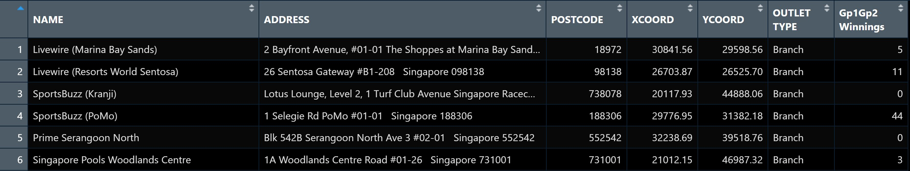
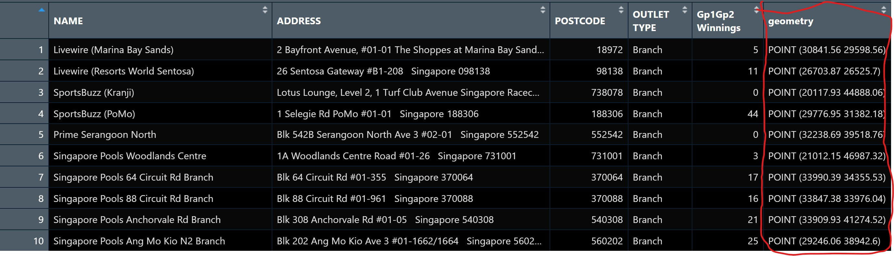

# 8.1 Overview

Proportional symbol maps, also known as graduated symbol maps, use varying symbol sizes to represent differences in the magnitude of a discrete, rapidly changing phenomenon, such as population counts. Like choropleth maps, these maps can be either classed or unclassed. Classed versions, called range-graded or graduated symbols, group values into categories, while unclassed versions, known as proportional symbols, scale symbol areas directly based on attribute values. In this exercise, we'll use the **tmap** package in R to create a proportional symbol map illustrating the number of wins at Singapore Pools outlets.

# 8.2 Learning Outcome

By the end of this hands-on exercise, we will develop the following skills using relevant R packages:

-   Importing an aspatial data file into R.
-   Converting the data into a simple point feature dataframe while assigning an appropriate projection reference.
-   Creating interactive proportional symbol maps.

# 8.3 Getting Started

Before we get started, first we need to load the required packages.

```{r}
pacman::p_load(sf, tmap, tidyverse)
```

# 8.4 Geospatial Data Wrangling

## 8.4.1 The data

The data set use for this hands-on exercise is called *SGPools_svy21*. The data is in csv file format.

Figure below shows the first 15 records of SGPools_svy21.csv. It consists of seven columns. The XCOORD and YCOORD columns are the x-coordinates and y-coordinates of SingPools outlets and branches. They are in [Singapore SVY21 Projected Coordinates System](https://www.sla.gov.sg/sirent/CoordinateSystems.aspx).

{width="765"}

## 8.4.2 Data Import and Preparation

The code chunk below uses *read_csv()* function of **readr** package to import *SGPools_svy21.csv* into R as a tibble data frame called *sgpools*.

```{r}
sgpools <- read_csv("data/aspatial/SGPools_svy21.csv")
```

The code chunk below shows list() is used to examine if the data file has been imported correctly.

```{r}
list(sgpools) 
```

Note - The *sgpools* data is in tibble data frame and not the common R data frame.

## 8.4.3 Creating a sf data frame from an aspatial data frame

The code chunk below converts sgpools data frame into a simple feature data frame by using *st_as_sf()* of **sf** packages

```{r}
sgpools_sf <- st_as_sf(sgpools, 
                       coords = c("XCOORD", "YCOORD"),
                       crs= 3414)
```

Key takeaways from the arguments above:

-   The coords argument requires specifying the x-coordinate column first, followed by the y-coordinate column.
-   The crs argument requires the coordinate system to be provided in EPSG format. For example, [EPSG: 3414](https://epsg.io/3414) represents Singapore's SVY21 Projected Coordinate System. We can find EPSG codes for other countries at [epsg.io](https://epsg.io).

Figure below shows the data table of *sgpools_sf*. Notice that a new column called geometry has been added into the data frame.



We can display the basic information of the newly created sgpools_sf by using the code chunk below.

```{r}
list(sgpools_sf)
```

The output shows that sgppols_sf is in point feature class. It’s epsg ID is 3414. The bbox provides information of the extend of the geospatial data.

# 8.5 Drawing Proportional Symbol Map

To create an interactive proportional symbol map in R, the view mode of tmap will be used.

The code chunk below will turn on the interactive mode of tmap.

```{r}
tmap_mode("view")
```

## 8.5.1 It all started with an interactive point symbol map

The code chunks below are used to create an interactive point symbol map.

```{r}
tm_shape(sgpools_sf)+
tm_bubbles(col = "red",
           size = 1,
           border.col = "black",
           border.lwd = 1)
```

## 8.5.2 Lets make it proportional

To draw a proportional symbol map, we need to assign a numerical variable to the size visual attribute. The code chunks below show that the variable *Gp1Gp2Winnings* is assigned to size visual attribute.

```{r}
tm_shape(sgpools_sf)+
tm_bubbles(col = "red",
           size = "Gp1Gp2 Winnings",
           border.col = "black",
           border.lwd = 1)
```

## 8.5.3 Lets give it a different colour

The proportional symbol map can be further improved by using the colour visual attribute. In the code chunks below, *OUTLET_TYPE* variable is used as the colour attribute variable.

```{r}
tm_shape(sgpools_sf)+
tm_bubbles(col = "OUTLET TYPE", 
          size = "Gp1Gp2 Winnings",
          border.col = "black",
          border.lwd = 1)
```

## 8.5.4 I have a twin brother :)

An impressive and little-know feature of **tmap**’s view mode is that it also works with faceted plots. The argument *sync* in *tm_facets()* can be used in this case to produce multiple maps with synchronised zoom and pan settings.

```{r}
tm_shape(sgpools_sf) +
  tm_bubbles(col = "OUTLET TYPE", 
          size = "Gp1Gp2 Winnings",
          border.col = "black",
          border.lwd = 1) +
  tm_facets(by= "OUTLET TYPE",
            nrow = 1,
            sync = TRUE)
```

Before we end the session, it is wiser to switch **tmap**’s Viewer back to plot mode by using the code chunk below.

```{r}
tmap_mode("plot")
```

# 8.6 Reference

## 8.6.1 All about tmap package

-   [tmap: Thematic Maps in R](https://www.jstatsoft.org/article/view/v084i06)
-   [tmap](https://cran.r-project.org/web/packages/tmap/index.html)
-   [tmap: get started!](https://cran.r-project.org/web/packages/tmap/vignettes/tmap-getstarted.html)
-   [tmap: changes in version 2.0](https://cran.r-project.org/web/packages/tmap/vignettes/tmap-changes-v2.html)
-   [tmap: creating thematic maps in a flexible way (useR!2015)](http://von-tijn.nl/tijn/research/presentations/tmap_user2015.pdf)
-   [Exploring and presenting maps with tmap (useR!2017)](http://von-tijn.nl/tijn/research/presentations/tmap_user2017.pdf)

## 8.6.2 Geospatial data wrangling

-   [sf: Simple Features for R](https://cran.r-project.org/web/packages/sf/index.html)
-   [Simple Features for R: StandardizedSupport for Spatial Vector Data](https://journal.r-project.org/archive/2018/RJ-2018-009/RJ-2018-009.pdf)
-   [Reading, Writing and Converting Simple Features](https://cran.r-project.org/web/packages/sf/vignettes/sf2.html)

## 8.6.3 Data wrangling

-   [dplyr](https://dplyr.tidyverse.org/)
-   [Tidy data](https://cran.r-project.org/web/packages/tidyr/vignettes/tidy-data.html)
-   [tidyr: Easily Tidy Data with ‘spread()’ and ‘gather()’ Functions](https://cran.r-project.org/web/packages/tidyr/tidyr.pdf)

# 
