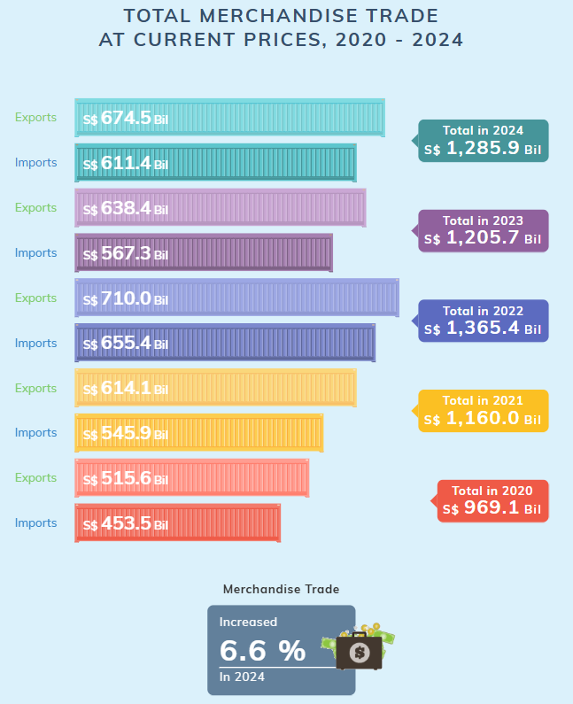
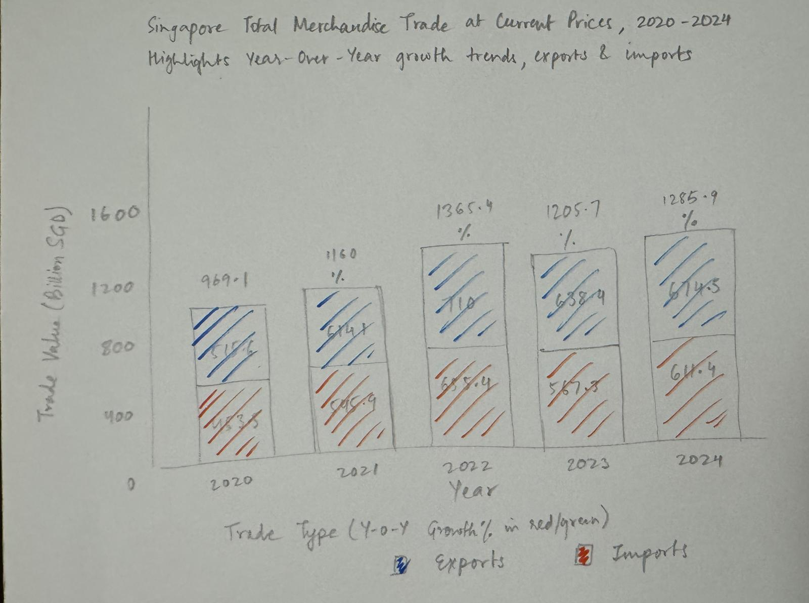
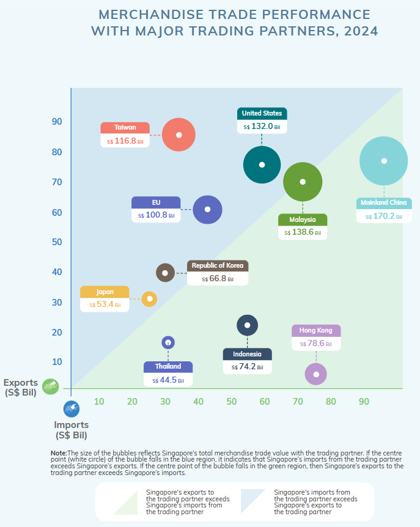
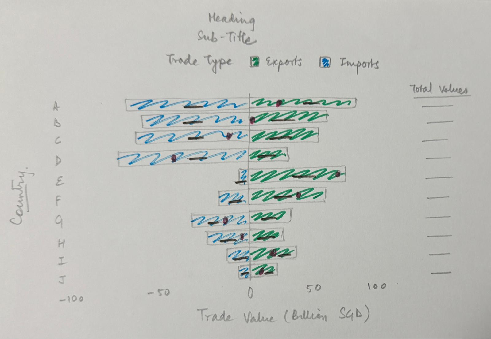
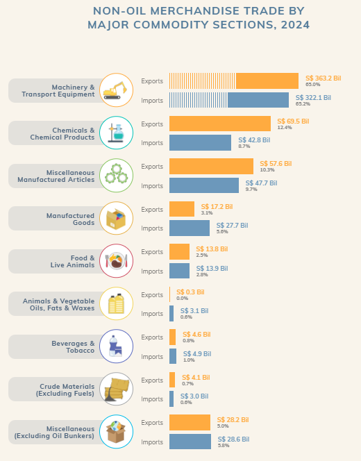
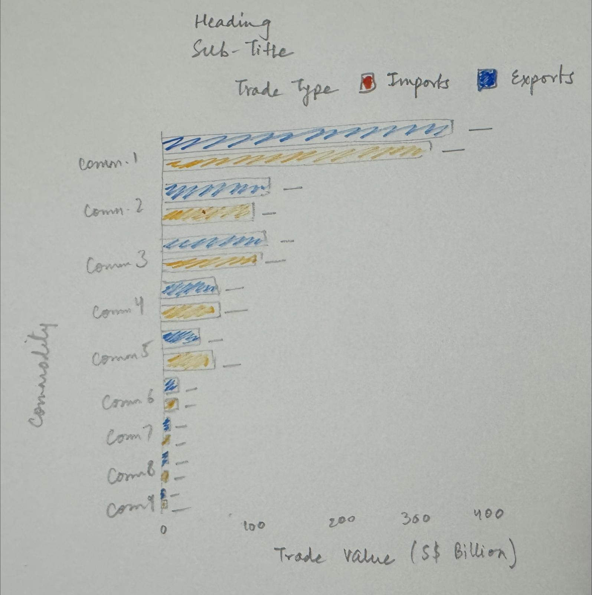

# 1 Overview

## 1.1 Setting the scene

With Donald Trump’s return to the U.S. presidency in 2025, global trade has become a focal point of economic discussions. As a highly trade-dependent nation, Singapore’s merchandise trade trends offer valuable insights into shifting global dynamics.

This exercise provides an opportunity to apply data visualization and time-series analysis techniques to explore Singapore’s international trade trends since 2015.

## 1.2 Our task

This take-home exercise involves:

1.  Data Extraction & Preparation of datasets from the Department of Statistics Singapore (DOS).

2.  Critique & Makeover of Three Data Visualizations - Select three trade-related visualizations from [this page](https://www.singstat.gov.sg/modules/infographics/singapore-international-trade), analyze their effectiveness, and propose improved versions using ggplot2.

3.  Time-Series Analysis - Analyze trade patterns from 2015 to 2024 using appropriate time-series techniques and visualizations

# 2 Getting started

## 2.1 Load packages

The R packages used in this take-home exercise are:

-   [**tidyverse**](https://www.tidyverse.org/) - (i.e. readr, tidyr, dplyr, ggplot2) A collection of core packages designed for data science, used extensively for data preparation and wrangling.
-   [**readxl**](https://readxl.tidyverse.org/) – Enables reading Excel files (`.xlsx`, `.xls`) into R without requiring external dependencies.
-   [**scales**](https://scales.r-lib.org/) – Provides tools for formatting and transforming numeric data in visualizations (e.g., percentage scales, log transformations).
-   [**ggrepel**](https://ggrepel.slowkow.com/) – Improves readability of text labels in **ggplot2** by preventing overlapping and ensuring clear label placement.

The code chunk below uses the `p_load()` function in the **pacman** package to check if the packages are installed in the computer. If yes, they are then loaded into the R environment. If no, they are installed, and then loaded into the R environment.

```{r}
pacman::p_load(tidyverse, readxl, scales, ggrepel)
```

## 2.2 Import the data

The dataset (*data/Merchandise_trade_by_Region.xlsx* and *data/Merchandise_trade_by_Commodity.xlsx*) has been downloaded from [Merchandise Trade by Region/Market](https://www.singstat.gov.sg/find-data/search-by-theme/trade-and-investment/merchandise-trade/latest-data) website.

The code chunk below imports the excel workbooks into R environment by using the `read_excel()`  function. Since each workbook contains multiple sheets with extra headers and footnotes, we extract only the relevant data by specifying the exact sheet name and cell range for extraction.

```{r}
# Merchandise Trade by Region/Market
region_imports <- read_excel("data/Merchandise_trade_by_Region.xlsx", "T1", "A11:JF171")
region_domestic_exports <- read_excel("data/Merchandise_trade_by_Region.xlsx", "T2", "A11:JF171")
region_re_exports <- read_excel("data/Merchandise_trade_by_Region.xlsx", "T3", "A11:JF171")

# Merchandise Trade by Commodity Section/Division
commodity_current_prices <- read_excel("data/Merchandise_trade_by_Commodity.xlsx", "T1", "A11:ABF79")
```

# 3 Data Overview

The *Merchandise Trade by Region* dataset consists of 266 columns and 160 rows for all sheets, covering monthly trade data from January 2003 to January 2025. It includes three main Trade Types: *Imports, Domestic Exports and Re-exports.* The dataset is categorized under the *Data Series* field, which provides multiple levels of geographic aggregation:

1.  **Total All Markets** – Overall trade performance across all markets.
2.  **Continent-Level Data** – Trade values aggregated by continents (e.g., Asia, Europe, America).
3.  **Country-Level Data** – More granular insights into individual trading partners.

```{r}
head(region_imports)
```

The *commodity_current_prices* table consists of 734 columns and 68 rows covering monthly trade data from January 1964 to January 2025. This section tracks trade data at a regional level, with trade classified into *Total Trade, Imports, Exports, Domestic Exports, and Re-exports*. Each of these trade types is further divided into *Oil and Non-Oil trade categories*, with more granular sub-categories.

```{r}
head(commodity_current_prices)
```

## 3.1 Data Preparation for Trade by Region dataset

1.  This data preparation process involves combining multiple trade datasets (*Imports, Domestic Exports, and Re-exports*) into a unified dataset.

2.  Adding a TradeType column to differentiate them.

3.  The data, originally in a wide format (with months as columns), is transformed into a long format using `pivot_longer()`, ensuring each row represents a specific Year-Month trade value.

4.  We then rename columns for consistency, convert Year-Month into a proper Date format, and filter out data before 2015, keeping only trade records from 2015 to 2025 for analysis.

    Now our modified table *region_trade_data* is ready for making visualizations.

```{r}
# Add a column to indicate the trade type
region_imports$TradeType <- "Imports"
region_domestic_exports$TradeType <- "Domestic Exports"
region_re_exports$TradeType <- "Re-exports"

# Combine all datasets into one
region_trade_data <- bind_rows(region_imports, region_domestic_exports, region_re_exports)

# Convert from wide format (months as columns) to long format
region_trade_data <- region_trade_data %>%
  pivot_longer(cols = starts_with("2003") | starts_with("2004") | 
                    starts_with("2005") | starts_with("2006") | starts_with("2007") | 
                    starts_with("2008") | starts_with("2009") | starts_with("2010") | 
                    starts_with("2011") | starts_with("2012") | starts_with("2013") | 
                    starts_with("2014") | starts_with("2015") | starts_with("2016") | 
                    starts_with("2017") | starts_with("2018") | starts_with("2019") | 
                    starts_with("2020") | starts_with("2021") | starts_with("2022") | 
                    starts_with("2023") | starts_with("2024") | starts_with("2025"),  
               names_to = "Year_Month",
               values_to = "Trade_Value")

# Rename "Data Series" column for easier handling
region_trade_data <- region_trade_data %>%
  rename(Data_Series = `Data Series`)  # Replace space with underscore

# Convert Year_Month to proper Date format
region_trade_data <- region_trade_data %>%
  separate(Year_Month, into = c("Year", "Month"), sep = " ", remove = FALSE) %>%
  mutate(Year = as.integer(Year),
         Month = match(Month, month.abb),  # Convert "Jan", "Feb", etc. to numeric
         Date = as.Date(paste(Year, Month, "01", sep = "-")))  # Create a full Date column

# **Filter for Year 2015 and Above**
region_trade_data <- region_trade_data %>%
  filter(Year >= 2015)

# View the transformed data
head(region_trade_data)
```

## 3.2 Data Preparation for *commodity_current_prices* table

1.  This data preparation process focuses on cleaning and structuring the *commodity_current_prices* dataset by renaming columns, classifying known trade types (Imports and Exports), and filtering only relevant data for 2024.

2.  Since the dataset contains additional rows beyond what is needed, we explicitly label only the rows related to Imports and Exports while keeping others unclassified (`NA`).

3.  The data is then transformed from wide format to long format using `pivot_longer()`, ensuring each row represents a specific trade record for a given month.

4.  Finally, we extract year and month information for accurate analysis.

    This structured approach ensures a clean and focused dataset for *commodity trade insights in 2024*.

```{r}
# Rename "Data Series" column for easier handling
commodity_current_prices <- commodity_current_prices %>%
  rename(Data_Series = `Data Series`)  # Replace space with underscore

# Identify and Classify Rows Based on Known Structure
commodity_current_prices <- commodity_current_prices %>%
  mutate(
    # Define Trade Type (Imports, Exports, etc.)
    Trade_Type = case_when(
      row_number() >= 19 & row_number() <= 27 ~ "Imports",
      row_number() >= 33 & row_number() <= 41 ~ "Exports",
      TRUE ~ NA_character_
    ),
  )

# Filter for Relevant Data
commodity_current_prices <- commodity_current_prices %>%
  select(Data_Series, Trade_Type, matches("2024"))  # Keep only 2024 year columns

# Convert Wide Format to Long Format
commodity_current_prices <- commodity_current_prices %>%
  pivot_longer(cols = -c(Trade_Type, Data_Series),  
               names_to = "Year_Month",
               values_to = "Trade_Value")

# Extract Year and Month
commodity_current_prices <- commodity_current_prices %>%
  separate(Year_Month, into = c("Year", "Month"), sep = " ", remove = FALSE) %>%
  mutate(Year = as.integer(Year),
         Month = match(Month, month.abb),
         Trade_Value = as.numeric(Trade_Value))  # Convert trade values to numeric

head(commodity_current_prices)
```

# 4 Data Visualization Makeover

In this section, we will analyze and improve three key visualizations from the [**Department of Statistics (DOS) Singapore**](https://www.singstat.gov.sg/modules/infographics/singapore-international-trade) website. These visualizations present insights into **Singapore's international trade**, but they have certain limitations in terms of clarity, aesthetics, and storytelling.

We will critique each chart, identifying its strengths and weaknesses based on **visual perception principles, effective data communication, and best practices in data visualization**. After the critique, we will propose and implement a makeover version of the chart to enhance the clarity, interpretability, and impact of the visualizations,.

## 4.1 Visualization 1: Total Merchandise Trade of Singapore (2020 - 2024)

The original visualization aims to present Singapore's merchandise trade trends (2020 - 2024) by displaying Exports and Imports separately for each year and highlighting the Total Trade per year with labeled blocks. The percentage increase in total trade for 2024 is displayed in the end.

::: panel-tabset
## Original

{width="317"}

**Clarity:**

-   **Consistent Structure** – The visualization maintains a uniform bar format, making trade trends easy to follow.
-   **Total Trade Highlighting** – Labeled total trade values ensure clarity in overall trade volume.
-   **Percentage Growth Emphasis** – The 6.6% increase in 2024 is visually emphasized with an icon, drawing attention to trade growth.

**Aesthetics:**

-   **Color Coding for Different Years** – Each year has a unique color, improving trend distinction.
-   **Exports vs. Imports Clearly Differentiated** – The color scheme separates exports and imports effectively.
-   **Neatly Aligned Design** – Labels, totals, and bars are well-organized, ensuring readability.
-   **Icons Enhance Engagement** – The use of containers for bars and financial icons adds a visually appealing touch.

## Areas of Improvement

**Clarity Issues:**

-   **Total Trade Trends Not Instantly Obvious** – Users need to manually compare total trade values across years.
-   **No Trade Balance Representation** – The visualization lacks a quick indicator of whether each year had a trade surplus or deficit. The 6.6% **doesnt indicate** if its 2020-2024 comparison or 2023-2024 comparison.
-   **Difficult to Compare Exports vs. Imports Over Time** – The separate year-based colors make it harder to track long-term trends.

**Aesthetic Issues:**

-   **Unnecessary Hatching Pattern** – The striped/hatching effect on bars clutters the visualization without adding value.
-   **Too Many Colors Reduce Comparability** – Different colors for each year make trend comparisons less intuitive.
:::

#### **Sketch suggestions**

{width="483"}

-   **Stacked bar chart format** to compare **Imports vs. Exports** effectively.
-   **Total trade values labeled above bars** for easier understanding.
-   **Year-over-year growth (%) added** with **green/red color coding** for quick and better trend analysis.
-   **Consistent color scheme** (Exports: Blue, Imports: Orange) for easier tracking.
-   **Improved spacing & alignment** to enhance readability and avoid clutter.

#### Improved Visualization

::: panel-tabset
## The plot

```{r}
#| echo: false
# Group domestic exports and re-exports into one category ("Exports")
df_filtered_1 <- region_trade_data %>%
  mutate(TradeType = ifelse(TradeType %in% c("Domestic Exports", "Re-exports"), "Exports", TradeType))

# Load and preprocess the data
df_filtered_1 <- df_filtered_1 %>%
  filter(Data_Series == "Total All Markets", Year >= 2020, Year <= 2024) %>%
  group_by(Year, TradeType) %>%
  summarise(Total_Trade_Value = sum(Trade_Value) / 1e3, .groups = "drop")  # Convert to billions

# Compute total trade per year
df_total_trade <- df_filtered_1 %>%
  group_by(Year) %>%
  summarise(Total_Trade = sum(Total_Trade_Value), .groups = "drop") %>%
  arrange(Year) %>%
  mutate(Growth_Percentage = (Total_Trade / lag(Total_Trade) - 1) * 100)  # Calculate YoY Growth %

# Ensure correct ordering of Exports & Imports for stacking
df_filtered_1$TradeType <- factor(df_filtered_1$TradeType, levels = c("Exports", "Imports"))

# Create the stacked bar chart 
ggplot(df_filtered_1, aes(x = factor(Year), y = Total_Trade_Value, fill = TradeType)) +
  geom_bar(stat = "identity", size = 0, width = 0.7) +
  geom_text(aes(label = paste0(round(Total_Trade_Value, 1))), 
            position = position_stack(vjust = 0.5), size = 3.5, color = "white") +  # Labels inside bars
  geom_text(data = df_total_trade, aes(x = factor(Year), y = Total_Trade * 1.16, 
                                       label = paste0(round(Total_Trade, 1))), 
            inherit.aes = FALSE, size = 4, color = "black") +  # Total Trade Labels
  geom_text(data = df_total_trade, aes(x = factor(Year), y = Total_Trade * 1.06, 
                                       label = ifelse(is.na(Growth_Percentage), "", 
                                                      paste0(ifelse(Growth_Percentage > 0, "+", ""), 
                                                             round(Growth_Percentage, 1), "%"))), 
            inherit.aes = FALSE, size = 3.5, fontface = "bold", 
            color = ifelse(df_total_trade$Growth_Percentage >= 0, "darkgreen", "red")) +  # Growth % Labels
  scale_fill_manual(
    values = c("Exports" = "#1F77B4", "Imports" = "#ff7f00"),
    labels = c("Exports", "Imports")
  ) +
  guides(fill = guide_legend(title = "Trade Type (YoY Growth % in red/green)")) +  

  # Titles and Labels
  labs(title = "Singapore Total Merchandise Trade at Current Prices, 2020 - 2024",
       subtitle = "Highlights Year-over-Year growth trends, exports and imports",
       x = "Year",
       y = "Trade Value (Billion SGD)",
       fill = "Trade Type") +

  theme_minimal(base_size = 10) +  
  theme(legend.position = "bottom") + 
  scale_y_continuous(labels = comma, breaks = seq(0, max(df_total_trade$Total_Trade) * 1.2, by = 400), 
                     expand = expansion(mult = c(0, 0.20)))  

```

## The code

```{r}
#| eval: false
# Group domestic exports and re-exports into one category ("Exports")
df_filtered_1 <- region_trade_data %>%
  mutate(TradeType = ifelse(TradeType %in% c("Domestic Exports", "Re-exports"), "Exports", TradeType))

# Load and preprocess the data
df_filtered_1 <- df_filtered_1 %>%
  filter(Data_Series == "Total All Markets", Year >= 2020, Year <= 2024) %>%
  group_by(Year, TradeType) %>%
  summarise(Total_Trade_Value = sum(Trade_Value) / 1e3, .groups = "drop")  # Convert to billions

# Compute total trade per year
df_total_trade <- df_filtered_1 %>%
  group_by(Year) %>%
  summarise(Total_Trade = sum(Total_Trade_Value), .groups = "drop") %>%
  arrange(Year) %>%
  mutate(Growth_Percentage = (Total_Trade / lag(Total_Trade) - 1) * 100)  # Calculate YoY Growth %

# Ensure correct ordering of Exports & Imports for stacking
df_filtered_1$TradeType <- factor(df_filtered_1$TradeType, levels = c("Exports", "Imports"))

# Create the stacked bar chart 
ggplot(df_filtered_1, aes(x = factor(Year), y = Total_Trade_Value, fill = TradeType)) +
  geom_bar(stat = "identity", size = 0, width = 0.7) +
  geom_text(aes(label = paste0(round(Total_Trade_Value, 1))), 
            position = position_stack(vjust = 0.5), size = 3.5, color = "white") +  # Labels inside bars
  geom_text(data = df_total_trade, aes(x = factor(Year), y = Total_Trade * 1.16, 
                                       label = paste0(round(Total_Trade, 1))), 
            inherit.aes = FALSE, size = 4, color = "black") +  # Total Trade Labels
  geom_text(data = df_total_trade, aes(x = factor(Year), y = Total_Trade * 1.06, 
                                       label = ifelse(is.na(Growth_Percentage), "", 
                                                      paste0(ifelse(Growth_Percentage > 0, "+", ""), 
                                                             round(Growth_Percentage, 1), "%"))), 
            inherit.aes = FALSE, size = 3.5, fontface = "bold", 
            color = ifelse(df_total_trade$Growth_Percentage >= 0, "darkgreen", "red")) +  # Growth % Labels
  scale_fill_manual(
    values = c("Exports" = "#1F77B4", "Imports" = "#ff7f00"),
    labels = c("Exports", "Imports")
  ) +
  guides(fill = guide_legend(title = "Trade Type (YoY Growth % in red/green)")) +  

  # Titles and Labels
  labs(title = "Singapore Total Merchandise Trade at Current Prices, 2020 - 2024",
       subtitle = "Highlights Year-over-Year growth trends, exports and imports",
       x = "Year",
       y = "Trade Value (Billion SGD)",
       fill = "Trade Type") +

  theme_minimal(base_size = 10) +  
  theme(legend.position = "bottom") + 
  scale_y_continuous(labels = comma, breaks = seq(0, max(df_total_trade$Total_Trade) * 1.2, by = 400), 
                     expand = expansion(mult = c(0, 0.20)))  

```
:::

## 4.2 Visualization 2: Merchandise Trade Performance with major trading partners, 2024

The original visualization was a bubble chart that aimed to represent: Trade Value per Country by the size of bubbles and Trade Balance (Exports vs. Imports) by their positioning in quadrant halves.

::: panel-tabset
## Original

{width="331"}

**Clarity:**

-   **Trade balance visibility** – Bubble position clearly showed whether a country had a trade surplus (exports \> imports) or trade deficit (imports \> exports).
-   **Total trade per country** – Larger bubbles represented higher total trade values.
-   **Quick identification of dominant trade partners** – Countries with the most significant trade relationships were instantly recognizable.

**Aesthetics:**

-   **Visually engaging and intuitive** – The bubble format made it interactive and easy to understand.
-   **Color-coded quadrants** – Helped distinguish between import-heavy vs. export-heavy countries.
-   **Compact and non-cluttered** – Allowed users to view multiple trade relationships at once.

## Areas of Improvement

**Clarity Issues:**

-   **Difficult to compare trade values precisely** – Relying on bubble sizes makes it harder to interpret
-   **Trade surplus/deficit not explicitly labeled** – Users had to estimate trade balance from bubble position.

**Aesthetic Issues:**

-   **Confusing axis labeling** – **Imports is Y-axis** and **Exports is X-axis** but their label positioning created misinterpretation without color guidance.
-   **Too many colors created clutter** – Some **countries shared the same color**, leading to confusion (e.g., **Thailand and EU were identical**).
-   **Lack of gridlines for reference** – Made precise interpretation of import/export values more difficult.
:::

#### Sketch suggestions

{width="454"}

-   **Switched to a Divergent Bar Chart** → Imports are **negative** and Exports are **positive**, making trade balance more intuitive.
-   **Added Net Trade Balance as Red Dots** → Clearly shows whether a country has a trade surplus or deficit.
-   **Labeled Total Trade per Country** → Numbers on the right side highlight total trade volume for better comparison.
-   **Improved Color Scheme** → Exports = Green, Imports = Blue for clear differentiation.
-   **Gives additional insights easily** such as even though China and Malaysia are export heavy, Hong Kong has the best Trade surplus whereas Taiwan has the worst Trade deficit.

#### Improved Visualization

::: panel-tabset
## The plot

```{r}
#| echo: false
# Rename "Data Series" for easier handling
df <- region_trade_data %>%
  rename(Country = `Data_Series`)  # Rename column for clarity

# Filter for the year 2024 and exclude "Total All Markets" & Continents
df_filtered <- df %>%
  filter(Year == 2024, 
         !Country %in% c("Total All Markets", "Asia", "Europe", "America", "Oceania", "Africa"))

# Group domestic exports and re-exports into one category ("Exports")
df_filtered <- df_filtered %>%
  mutate(TradeType = ifelse(TradeType %in% c("Domestic Exports", "Re-exports"), "Exports", TradeType))

# Aggregate trade values per country (sum imports and exports)
df_summary <- df_filtered %>%
  group_by(Country, TradeType) %>%
  summarise(Total_Trade_Value = sum(Trade_Value), .groups = "drop")

# Convert Imports to negative values for divergence
df_summary <- df_summary %>%
  mutate(Total_Trade_Value = ifelse(TradeType == "Imports", -Total_Trade_Value, Total_Trade_Value))

# Convert values from Millions → Billions (SGD)
df_summary <- df_summary %>%
  mutate(Total_Trade_Value = Total_Trade_Value / 1000)  # Convert to billions

# Compute total trade value (absolute sum of imports + exports) per country for sorting
top_countries <- df_summary %>%
  group_by(Country) %>%
  summarise(Total_Trade = sum(abs(Total_Trade_Value)), .groups = "drop") %>%
  arrange(desc(Total_Trade)) %>%
  slice(1:10) %>%  # Select top 10 countries only
  pull(Country)  # Get ordered list of top 10 countries

# Compute trade balance per country (Exports - Imports)
trade_balance <- df_summary %>%
  group_by(Country) %>%
  summarise(Trade_Balance = sum(Total_Trade_Value), .groups = "drop") %>%
  filter(Country %in% top_countries)

# Compute total trade per country (to show as a separate label)
total_trade_labels <- df_summary %>%
  group_by(Country) %>%
  summarise(Total_Trade = sum(abs(Total_Trade_Value)), .groups = "drop") %>%
  filter(Country %in% top_countries)

# Filter dataset to keep only top 10 countries
df_top10 <- df_summary %>%
  filter(Country %in% top_countries)

# Sort the top 10 countries for proper ordering in the chart
df_top10$Country <- factor(df_top10$Country, levels = rev(top_countries))  

# Final Enhanced Divergent Bar Chart (with Total Trade Labels)
ggplot(df_top10, aes(x = Country, y = Total_Trade_Value, fill = TradeType)) +
  geom_bar(stat = "identity") +  # Standard bar chart
  geom_point(data = trade_balance, aes(x = Country, y = Trade_Balance), 
             color = "red", size = 3, shape = 18, inherit.aes = FALSE) +  
  geom_text(data = total_trade_labels, aes(x = Country, y = max(df_top10$Total_Trade_Value) * 1.2, 
                                           label = paste0(round(Total_Trade, 1), "B")), 
            size = 3.5, color = "black", inherit.aes = FALSE) +  
  coord_flip() +  
  scale_fill_manual(values = c("Imports" = "#1F77B4", "Exports" = "#2CA02C")) +
  labs(title = "Singapore's Top 10 Trading Partners: Merchandise Trade (2024)",
       subtitle = "Highlights Net Trade Balance (Red dots) with total trade values on the right",
       x = "Country",
       y = "Trade Value (Billion SGD)",
       fill = "Trade Type") +
  geom_text(aes(label = paste0(round(abs(Total_Trade_Value), 1))),  # Convert values to billion format
            position = position_stack(vjust = 0.5), size = 3, color = "black") +
  theme_minimal() +
  theme(legend.position = "top") +
  scale_y_continuous(labels = scales::comma)  
```

## The code

```{r}
#| eval: false
# Rename "Data Series" for easier handling
df <- region_trade_data %>%
  rename(Country = `Data_Series`)  # Rename column for clarity

# Filter for the year 2024 and exclude "Total All Markets" & Continents
df_filtered <- df %>%
  filter(Year == 2024, 
         !Country %in% c("Total All Markets", "Asia", "Europe", "America", "Oceania", "Africa"))

# Group domestic exports and re-exports into one category ("Exports")
df_filtered <- df_filtered %>%
  mutate(TradeType = ifelse(TradeType %in% c("Domestic Exports", "Re-exports"), "Exports", TradeType))

# Aggregate trade values per country (sum imports and exports)
df_summary <- df_filtered %>%
  group_by(Country, TradeType) %>%
  summarise(Total_Trade_Value = sum(Trade_Value), .groups = "drop")

# Convert Imports to negative values for divergence
df_summary <- df_summary %>%
  mutate(Total_Trade_Value = ifelse(TradeType == "Imports", -Total_Trade_Value, Total_Trade_Value))

# Convert values from Millions → Billions (SGD)
df_summary <- df_summary %>%
  mutate(Total_Trade_Value = Total_Trade_Value / 1000)  # Convert to billions

# Compute total trade value (absolute sum of imports + exports) per country for sorting
top_countries <- df_summary %>%
  group_by(Country) %>%
  summarise(Total_Trade = sum(abs(Total_Trade_Value)), .groups = "drop") %>%
  arrange(desc(Total_Trade)) %>%
  slice(1:10) %>%  # Select top 10 countries only
  pull(Country)  # Get ordered list of top 10 countries

# Compute trade balance per country (Exports - Imports)
trade_balance <- df_summary %>%
  group_by(Country) %>%
  summarise(Trade_Balance = sum(Total_Trade_Value), .groups = "drop") %>%
  filter(Country %in% top_countries)

# Compute total trade per country (to show as a separate label)
total_trade_labels <- df_summary %>%
  group_by(Country) %>%
  summarise(Total_Trade = sum(abs(Total_Trade_Value)), .groups = "drop") %>%
  filter(Country %in% top_countries)

# Filter dataset to keep only top 10 countries
df_top10 <- df_summary %>%
  filter(Country %in% top_countries)

# Sort the top 10 countries for proper ordering in the chart
df_top10$Country <- factor(df_top10$Country, levels = rev(top_countries))  

# Final Enhanced Divergent Bar Chart (with Total Trade Labels)
ggplot(df_top10, aes(x = Country, y = Total_Trade_Value, fill = TradeType)) +
  geom_bar(stat = "identity") +  # Standard bar chart
  geom_point(data = trade_balance, aes(x = Country, y = Trade_Balance), 
             color = "red", size = 3, shape = 18, inherit.aes = FALSE) +  
  geom_text(data = total_trade_labels, aes(x = Country, y = max(df_top10$Total_Trade_Value) * 1.2, 
                                           label = paste0(round(Total_Trade, 1), "B")), 
            size = 3.5, color = "black", inherit.aes = FALSE) +  
  coord_flip() +  
  scale_fill_manual(values = c("Imports" = "#1F77B4", "Exports" = "#2CA02C")) +
  labs(title = "Singapore's Top 10 Trading Partners: Merchandise Trade (2024)",
       subtitle = "Highlights Net Trade Balance (Red dots) with total trade values on the right",
       x = "Country",
       y = "Trade Value (Billion SGD)",
       fill = "Trade Type") +
  geom_text(aes(label = paste0(round(abs(Total_Trade_Value), 1))),  # Convert values to billion format
            position = position_stack(vjust = 0.5), size = 3, color = "black") +
  theme_minimal() +
  theme(legend.position = "top") +
  scale_y_continuous(labels = scales::comma)  
```
:::

## 4.3 Visualization 3: Non-Oil Merchandise Trade by Commodity (2024)

This visualization presents Exports vs. Imports across different commodity sections, using horizontal bar charts with percentage labels and absolute values.

::: panel-tabset
## Original

{width="457"}

**Clarity:**

-   The **horizontal bar chart** effectively compares **Imports vs. Exports** across commodity sections.
-   The bars allow for **quick scanning** across categories and enable easy value comparisons.
-   Each category includes a **percentage label** to show its contribution to **total imports or exports**.
-   Trade values are **explicitly stated next to the bars**, preventing users from having to estimate values.

**Aesthetics:**

-   **Exports (Orange) & Imports (Blue) are visually distinct**, making them easy to differentiate.
-   **Icons next to categories improve readability** and aid in quick recognition.
-   **Consistent formatting in labels** ensures uniformity and readability.

## Areas of Improvement

**Clarity Issues:**

-   **Lack of sorting**: The commodities are not ordered alphabetically, by total trade, by imports, or by exports, which makes it harder for users to understand.
-   **Percentage interpretation is unclear**: The percentages refer to the share of total trade in imports/exports, not the category itself, which can be misleading at a glance.
-   The chart tries to convey **two different messages without clear separation** - Total import/export % distribution (overall contribution of each category) and Absolute import vs. export values per commodity (direct comparison of trade values) making it difficult to interpret.

**Aesthetic Issues:**

-   **Trends are not immediately visible**: While the numbers provide useful insights, users must read all the labels manually instead of quickly spotting trends through the visualization.
-   **Color choice is misleading**: Blue typically represents positive values, while orange/amber is often associated with warnings or negatives. Here, **Exports are in orange and Imports are in blue**, which can lead to misinterpretation.
:::

#### Sketch suggestions

{width="449"}

-   **Sorted commodities by total trade volume**, for easier identification of dominant commodities.
-   **Now only displays absolute values**, removing confusion between percentage distribution vs. trade values.
-   **Top three commodities' dominance in both export and import is clearly visible** without additional explanation.
-   **Better chart description** to guide users on key takeaways.
-   **Revised color scheme**: Exports in **blue** (positive), Imports in **orange** (negative), improving interpretation.

#### Improved Visualization

::: panel-tabset
## The plot

```{r}
#| echo: false
#| fig-height: 6
# Step 1: Compute Total Trade Value per Commodity
commodity_data <- commodity_current_prices %>%
  filter(Trade_Type %in% c("Imports", "Exports")) %>%
  group_by(Data_Series, Trade_Type) %>%
  summarise(Total_Trade_Value = sum(Trade_Value, na.rm = TRUE), .groups = "drop") %>%
  
  # Convert to Billions 
  mutate(Total_Trade_Value_B = round(Total_Trade_Value / 1e6, 1))

# Step 2: Compute Total Trade Per Commodity (Imports + Exports) for Sorting
total_trade <- commodity_data %>%
  group_by(Data_Series) %>%
  summarise(Total_Trade = sum(Total_Trade_Value_B), .groups = "drop")

# Step 3: Merge Total Trade for Sorting & Sort in **Ascending Order**
commodity_data <- commodity_data %>%
  left_join(total_trade, by = "Data_Series") %>%
  arrange(Total_Trade) %>%  
  mutate(Data_Series = factor(Data_Series, levels = unique(Data_Series)))  # Maintain order in plot

# Step 4: Ensure Exports is Plotted Above Imports (Reverse Factor Levels)
commodity_data$Trade_Type <- factor(commodity_data$Trade_Type, levels = c("Imports", "Exports"))

# Step 5: Create Double Bar Chart (Exports Above Imports)
ggplot(commodity_data, aes(x = Data_Series, y = Total_Trade_Value_B, fill = Trade_Type)) +

  # Side-by-Side Bars for Imports & Exports (Thicker Bars)
  geom_bar(stat = "identity", position = position_dodge(width = 1), width = 0.8) +  

  # Add Trade Values **Inside Bars** to avoid being cut
  geom_text(aes(label = paste0(Total_Trade_Value_B, "B")), 
            position = position_dodge(width = 1), hjust = -0.1, size = 3, color = "black") +

  # Titles & Labels
  labs(title = "Non-Oil Merchandise Trade by Commodity (2024)",
       subtitle = "Highlights Top Commodities for Exports/Imports and \nsorted by Total Trade Value (Exports + Imports)",
       x = "Commodity",
       y = "Trade Value (S$ Billion)",
       fill = "Trade Type") +
  
  coord_flip() +

  # Adjust Chart Height & Prevent Cutting Issues
  theme_minimal(base_size = 9) +
  theme(legend.position = "top",
        axis.text.x = element_text(angle = 0, hjust = 1),
        axis.text.y = element_text(size = 10),
        panel.grid.major = element_blank(),
        panel.grid.minor = element_blank(),
        plot.title = element_text(size = 12, face = "bold"),  
        plot.margin = margin(40, 40, 20, 0)) +

  # Expand Y-Axis to Prevent Cutting of Top Value
  expand_limits(y = max(commodity_data$Total_Trade_Value_B) * 1.05) +

  # Custom Colors for Imports & Exports
  scale_fill_manual(values = c("Exports" = "blue", "Imports" = "orange"))

```

## The code

```{r}
#| eval: false
# Step 1: Compute Total Trade Value per Commodity
commodity_data <- commodity_current_prices %>%
  filter(Trade_Type %in% c("Imports", "Exports")) %>%
  group_by(Data_Series, Trade_Type) %>%
  summarise(Total_Trade_Value = sum(Trade_Value, na.rm = TRUE), .groups = "drop") %>%
  
  # Convert to Billions 
  mutate(Total_Trade_Value_B = round(Total_Trade_Value / 1e6, 1))

# Step 2: Compute Total Trade Per Commodity (Imports + Exports) for Sorting
total_trade <- commodity_data %>%
  group_by(Data_Series) %>%
  summarise(Total_Trade = sum(Total_Trade_Value_B), .groups = "drop")

# Step 3: Merge Total Trade for Sorting & Sort in **Ascending Order**
commodity_data <- commodity_data %>%
  left_join(total_trade, by = "Data_Series") %>%
  arrange(Total_Trade) %>%  
  mutate(Data_Series = factor(Data_Series, levels = unique(Data_Series)))  # Maintain order in plot

# Step 4: Ensure Exports is Plotted Above Imports (Reverse Factor Levels)
commodity_data$Trade_Type <- factor(commodity_data$Trade_Type, levels = c("Imports", "Exports"))

# Step 5: Create Double Bar Chart (Exports Above Imports)
ggplot(commodity_data, aes(x = Data_Series, y = Total_Trade_Value_B, fill = Trade_Type)) +

  # Side-by-Side Bars for Imports & Exports (Thicker Bars)
  geom_bar(stat = "identity", position = position_dodge(width = 1), width = 0.8) +  

  # Add Trade Values **Inside Bars** to avoid being cut
  geom_text(aes(label = paste0(Total_Trade_Value_B, "B")), 
            position = position_dodge(width = 1), hjust = -0.1, size = 3, color = "black") +

  # Titles & Labels
  labs(title = "Non-Oil Merchandise Trade by Commodity (2024)",
       subtitle = "Highlights Top Commodities for Exports/Imports and \nsorted by Total Trade Value (Exports + Imports)",
       x = "Commodity",
       y = "Trade Value (S$ Billion)",
       fill = "Trade Type") +
  
  coord_flip() +

  # Adjust Chart Height & Prevent Cutting Issues
  theme_minimal(base_size = 9) +
  theme(legend.position = "top",
        axis.text.x = element_text(angle = 0, hjust = 1),
        axis.text.y = element_text(size = 10),
        panel.grid.major = element_blank(),
        panel.grid.minor = element_blank(),
        plot.title = element_text(size = 12, face = "bold"),  
        plot.margin = margin(40, 40, 20, 0)) +

  # Expand Y-Axis to Prevent Cutting of Top Value
  expand_limits(y = max(commodity_data$Total_Trade_Value_B) * 1.05) +

  # Custom Colors for Imports & Exports
  scale_fill_manual(values = c("Exports" = "blue", "Imports" = "orange"))
```
:::

# 5 Time Series Analysis

## 5.1 Singapore's Total Trade Value Over Time (2015-2024)

::: panel-tabset
## The plot

```{r}
#| echo: false
region_trade_data %>%
  filter(Data_Series == "Total All Markets", Year >= 2015, Year <= 2024) %>%  # Filter for 2015-2024
  mutate(TradeType = ifelse(TradeType %in% c("Domestic Exports", "Re-exports"), "Exports", TradeType)) %>%
  group_by(Date, TradeType) %>%
  summarise(Trade_Value = sum(Trade_Value, na.rm = TRUE) / 1e2, .groups = "drop") %>%  # Convert to Billion S$
  ggplot(aes(x = Date, y = Trade_Value, color = TradeType)) +
  geom_line(size = 0.8) +

  # Ensure Y-axis starts from 0
  ylim(0, NA) +   # Forces minimum y-axis value to 0 (upper limit auto-adjusts)
  
  # Add Title and Subtitle for Context
  labs(title = "Singapore's Total Trade Value Over Time (2015-2024)",
       subtitle = "Comparison of Imports and Exports (Domestic + Re-Exports) \nMeasured in Billion S$",
       x = "Year",
       y = "Trade Value (Billion S$)",
       color = "Trade Type") +

  # Switch Colors: Exports = Orange, Imports = Blue
  scale_color_manual(values = c("Exports" = "blue", "Imports" = "orange")) +

  theme_minimal() +
  theme(plot.title = element_text(face = "bold", size = 14),
        plot.subtitle = element_text(size = 12, color = "gray40"))

```

## The code

```{r}
#| eval: false
region_trade_data %>%
  filter(Data_Series == "Total All Markets", Year >= 2015, Year <= 2024) %>%  # Filter for 2015-2024
  mutate(TradeType = ifelse(TradeType %in% c("Domestic Exports", "Re-exports"), "Exports", TradeType)) %>%
  group_by(Date, TradeType) %>%
  summarise(Trade_Value = sum(Trade_Value, na.rm = TRUE) / 1e2, .groups = "drop") %>%  # Convert to Billion S$
  ggplot(aes(x = Date, y = Trade_Value, color = TradeType)) +
  geom_line(size = 0.8) +

  # Ensure Y-axis starts from 0
  ylim(0, NA) +   # Forces minimum y-axis value to 0 (upper limit auto-adjusts)
  
  # Add Title and Subtitle for Context
  labs(title = "Singapore's Total Trade Value Over Time (2015-2024)",
       subtitle = "Comparison of Imports and Exports (Domestic + Re-Exports) \nMeasured in Billion S$",
       x = "Year",
       y = "Trade Value (Billion S$)",
       color = "Trade Type") +

  # Switch Colors: Exports = Orange, Imports = Blue
  scale_color_manual(values = c("Exports" = "blue", "Imports" = "orange")) +

  theme_minimal() +
  theme(plot.title = element_text(face = "bold", size = 14),
        plot.subtitle = element_text(size = 12, color = "gray40"))
```
:::

#### Insights -

-   **Overall Growth in Trade -** Both **Imports and Exports have grown steadily** over the years, with fluctuations. The **general upward trend** suggests a **healthy expansion in trade activities**.

-   **Exports consistently exceeds Imports throughout the years** indicating a **trade surplus** for most years.

-   Noticeable **sharp fluctuations in both Imports and Exports**, particularly around **2020-2022**. Global trade disruptions and economic slowdown due to COVID-19 pandemic (2020-2021) indicate downfall while sharp trade rebound post-pandemic indicates recovery period (2022)

## 5.2 Singapore's Net Exports by Continent (2015-2024)

::: panel-tabset
## The plot

```{r}
#| echo: false
region_trade_data %>%
  filter(Data_Series %in% c("Asia", "Europe", "America", "Oceania", "Africa"), Year >= 2015, Year <= 2024) %>%  # Filter for continents
  mutate(TradeType = ifelse(TradeType %in% c("Domestic Exports", "Re-exports"), "Exports", TradeType)) %>%
  group_by(Date, Data_Series, TradeType) %>%
  summarise(Trade_Value = sum(Trade_Value, na.rm = TRUE) / 1e2, .groups = "drop") %>%  # Convert to Billion S$
  pivot_wider(names_from = TradeType, values_from = Trade_Value, values_fill = list(Trade_Value = 0)) %>%
  mutate(Net_Exports = Exports - Imports) %>%  # Calculate Net Exports
  ggplot(aes(x = Date, y = Net_Exports, color = Data_Series)) +
  geom_line(size = 0.7) +
  geom_hline(yintercept = 0, linetype = "dashed", color = "black", size = 0.8) +  # Highlight 0 axis
  labs(title = "Singapore's Net Exports by Continent (2015-2024)",
       subtitle = "Net Exports = Total Exports (Domestic + Re-Exports) - Imports \nMeasured in Billion S$",
       x = "Year",
       y = "Net Exports (Billion S$)",
       color = "Continent") +
  theme_minimal() +
  theme(legend.position = "bottom",
        plot.title = element_text(face = "bold", size = 14),
        plot.subtitle = element_text(size = 12, color = "gray40"))

```

## The code

```{r}
#| eval: false
region_trade_data %>%
  filter(Data_Series %in% c("Asia", "Europe", "America", "Oceania", "Africa"), Year >= 2015, Year <= 2024) %>%  # Filter for continents
  mutate(TradeType = ifelse(TradeType %in% c("Domestic Exports", "Re-exports"), "Exports", TradeType)) %>%
  group_by(Date, Data_Series, TradeType) %>%
  summarise(Trade_Value = sum(Trade_Value, na.rm = TRUE) / 1e2, .groups = "drop") %>%  # Convert to Billion S$
  pivot_wider(names_from = TradeType, values_from = Trade_Value, values_fill = list(Trade_Value = 0)) %>%
  mutate(Net_Exports = Exports - Imports) %>%  # Calculate Net Exports
  ggplot(aes(x = Date, y = Net_Exports, color = Data_Series)) +
  geom_line(size = 0.7) +
  geom_hline(yintercept = 0, linetype = "dashed", color = "black", size = 0.8) +  # Highlight 0 axis
  labs(title = "Singapore's Net Exports by Continent (2015-2024)",
       subtitle = "Net Exports = Total Exports (Domestic + Re-Exports) - Imports \nMeasured in Billion S$",
       x = "Year",
       y = "Net Exports (Billion S$)",
       color = "Continent") +
  theme_minimal() +
  theme(legend.position = "bottom",
        plot.title = element_text(face = "bold", size = 14),
        plot.subtitle = element_text(size = 12, color = "gray40"))
```
:::

#### Insights -

-   **Asia is the Largest Contributor to Net Exports - Asia (green line) shows consistently positive net exports**, meaning **Singapore exports more than it imports** from Asia.

-   **Europe (blue line) has a persistent negative net export value**, indicating that Singapore imports more than it exports to Europe. **America (yellow line) fluctuates around zero**, but with more frequent negative values, suggesting a marginal trade deficit.

-   **Suggests that Singapore depends mainly on Western markets for imports** as Africa and Oceania Maintain a Near-Balanced Trade.

## 5.3 Change in Total Trade for Top 10 Trading Partners of 2024 (2015 vs 2024)

::: panel-tabset
## The plot

```{r}
#| echo: false
#| fig-height: 5

# Define the top 10 trading partners
top_countries <- c("China", "Malaysia", "United States", "Taiwan", 
                   "Hong Kong", "Indonesia", "Korea, Rep Of", 
                   "Japan", "Thailand", "India")

# Step 1: Filter Data for 2015 & 2024
slope_data <- region_trade_data %>%
  filter(Data_Series %in% top_countries, Year %in% c(2015, 2024)) %>%
  group_by(Data_Series, Year) %>%
  summarise(Total_Trade = sum(Trade_Value, na.rm = TRUE) / 1e2, .groups = "drop")  # Convert to Billion S$

# Step 2: Define Colors for Countries
country_colors <- c("China" = "#E41A1C", "Hong Kong" = "#FF7F00", "India" = "#984EA3",
                    "Indonesia" = "#4DAF4A", "Japan" = "#377EB8", "Korea, Rep Of" = "#A65628",
                    "Malaysia" = "#F781BF", "Taiwan" = "#999999", "Thailand" = "#66C2A5", 
                    "United States" = "#A6CEE3")

# Step 3: Plot Final Slope Graph
ggplot(slope_data, aes(x = factor(Year), y = Total_Trade, group = Data_Series, color = Data_Series)) +
  geom_line(size = 1.5) +  # Connecting lines
  geom_text_repel(aes(label = round(Total_Trade, 1)), size = 4, color = "black", nudge_x = 0.2) +  # Black text
  scale_color_manual(values = country_colors, guide = guide_legend(override.aes = list(size = 4))) +  
  labs(title = "Change in Total Trade for Top 10 Trading Partners (2015 vs 2024)",
       subtitle = "Trade Value = Total Imports + Exports (Billion S$)",
       x = "Year", y = "Trade Value (Billion S$)", color = "Country") +
  theme_minimal() +
  theme(axis.text.x = element_text(size = 12, face = "bold"),
        axis.text.y = element_text(size = 10),
        legend.position = "right",  
        legend.text = element_text(color = "black"),  
        plot.title = element_text(size = 14, face = "bold"))
```

## The code

```{r}
#| eval: false
#| fig-height: 5

# Define the top 10 trading partners
top_countries <- c("China", "Malaysia", "United States", "Taiwan", 
                   "Hong Kong", "Indonesia", "Korea, Rep Of", 
                   "Japan", "Thailand", "India")

# Step 1: Filter Data for 2015 & 2024
slope_data <- region_trade_data %>%
  filter(Data_Series %in% top_countries, Year %in% c(2015, 2024)) %>%
  group_by(Data_Series, Year) %>%
  summarise(Total_Trade = sum(Trade_Value, na.rm = TRUE) / 1e2, .groups = "drop")  # Convert to Billion S$

# Step 2: Define Colors for Countries
country_colors <- c("China" = "#E41A1C", "Hong Kong" = "#FF7F00", "India" = "#984EA3",
                    "Indonesia" = "#4DAF4A", "Japan" = "#377EB8", "Korea, Rep Of" = "#A65628",
                    "Malaysia" = "#F781BF", "Taiwan" = "#999999", "Thailand" = "#66C2A5", 
                    "United States" = "#A6CEE3")

# Step 3: Plot Final Slope Graph
ggplot(slope_data, aes(x = factor(Year), y = Total_Trade, group = Data_Series, color = Data_Series)) +
  geom_line(size = 1.5) +  # Connecting lines
  geom_text_repel(aes(label = round(Total_Trade, 1)), size = 4, color = "black", nudge_x = 0.2) +  # Black text
  scale_color_manual(values = country_colors, guide = guide_legend(override.aes = list(size = 4))) +  
  labs(title = "Change in Total Trade for Top 10 Trading Partners (2015 vs 2024)",
       subtitle = "Trade Value = Total Imports + Exports (Billion S$)",
       x = "Year", y = "Trade Value (Billion S$)", color = "Country") +
  theme_minimal() +
  theme(axis.text.x = element_text(size = 12, face = "bold"),
        axis.text.y = element_text(size = 10),
        legend.position = "right",  
        legend.text = element_text(color = "black"),  
        plot.title = element_text(size = 14, face = "bold"))
```
:::

#### Insights - 

-   **All trading partners show positive growth over the period,** indicating expanding global trade relationships across the board.
-   **China maintains the dominant position** with the highest trade value and strongest growth, increasing from S\$1,285.7 billion to S\$1,701.8 billion (32% growth).
-   **Malaysia shows substantial growth**, rising from S\$985.8 billion to S\$1,386.4 billion (41% increase), firmly establishing its position as the **second largest trading partner**.
-   Some countries show modest growth, with **India and Japan having the lowest increase**.
-   **Taiwan shows impressive growth** from S\$539.1 billion to S\$1,167.9 billion (90% increase), one of the **largest percentage increases** among these trading partners.
-   The gap between the top traders (China, Malaysia, US, Taiwan) and the remaining countries has widened over the nine-year period, suggesting increasing concentration of trade among leading economies especially with Asian countries and its neighbour - Malaysia.

# 6 Summary and Conclusion

In this exercise, we explored Singapore’s merchandise trade trends (2015-2024) through data visualization makeovers and time-series analysis.

#### Visualization Makeovers  

-   The improved stacked bar chart for total merchandise trade enables direct comparison, uses consistent colors, and highlights growth trends effectively.
-   Replaced the bubble chart for trade balance with a diverging bar chart, making surpluses and deficits clearer across major trading partners.
-   Improved commodity trade visualizations by sorting categories, using clearer labels, and revising color schemes for better interpretation.

#### Time-Series Analysis 

-   Singapore’s trade grew consistently despite COVID-19 disruptions (2020-2021), with a strong recovery post-pandemic.
-   Exports have consistently outpaced imports, ensuring a trade surplus across most years.
-   Asia is Singapore’s largest export market, while Europe and America show more frequent trade deficits.
-   Slope graph analysis revealed China, Malaysia, US, and Taiwan as the fastest-growing trade partners, while Japan and India had slower growth.
