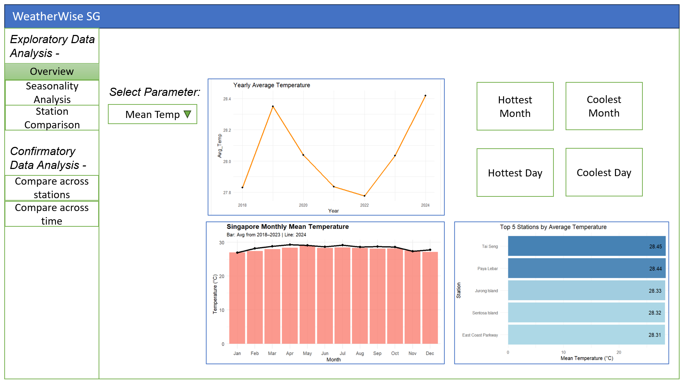
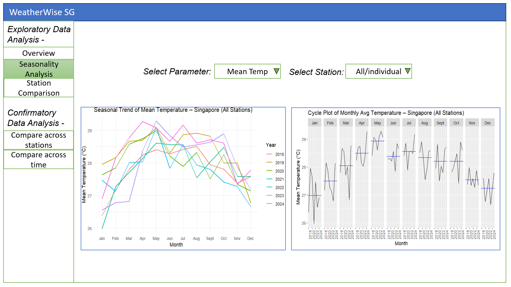
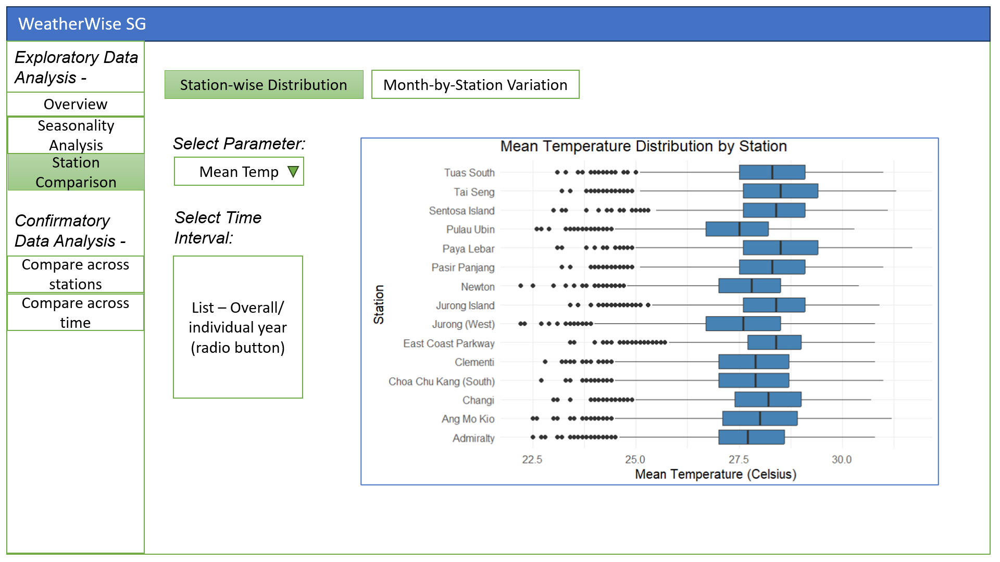
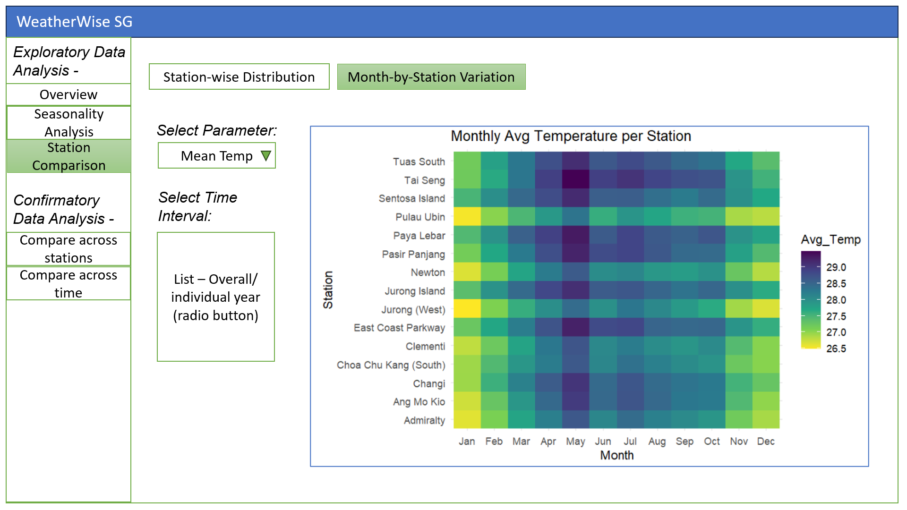
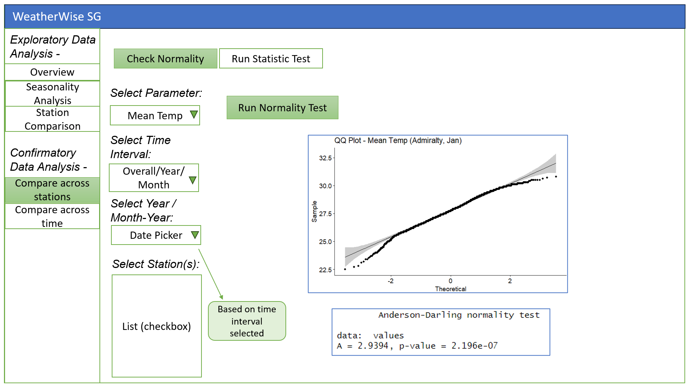
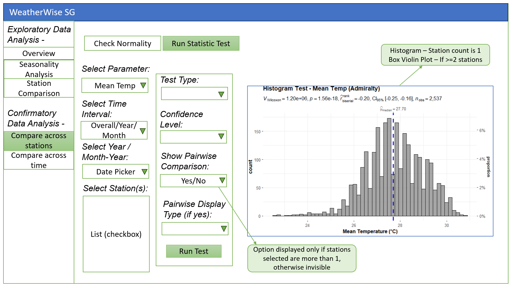
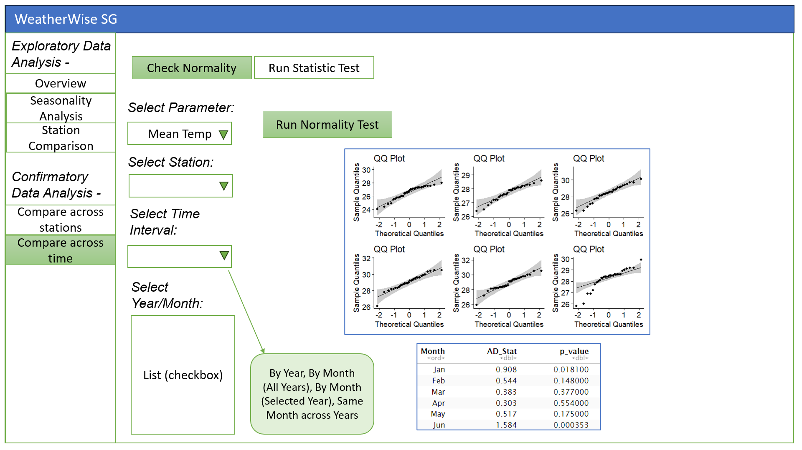
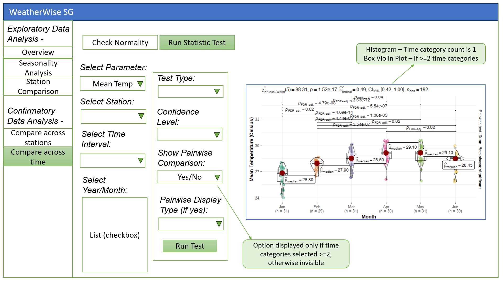

# 1 The Task

In this take-home exercise, we have to -

-   Select one functional module from our proposed Shiny application (EDA and CDA).
-   Evaluate R packages required by this module to ensure they are supported by CRAN.
-   Create prototype for our module by preparing/testing the R codes to be run and return the correct output as expected, determine the parameters and outputs that will be exposed on the Shiny applications.
-   Include a dedicated section on UI Design -A visual storyboard/mockup to demonstrate user flow and interactions detailing different UI components to be used and their purposes and placement. For storyboarding the UI Design, the [Storyboard](https://giniceseah.netlify.app/posts/2021-07-31-storyboard/) link is referred.

# 2 Getting Started

## 2.1 Loading the Packages

```{r}
pacman::p_load(lubridate, ggthemes, tidyverse,
               ggridges, corrplot, GGally, ggstatsplot,
               DT, viridis, forcats, nortest, patchwork,
               tsibble, feasts, ggpubr)
```

## 2.2 Importing the data

We import the Singapore Cleaned Weather Data as *weather* in the code below to explore trends across Singapore and various locations within the country. The dataset consists of daily weather records..

```{r}
weather <- read_csv("data/climate_final_2018_2024.csv")
```

# 3 Data Preparation

To obtain the csv file imported earlier, multiple data preparations steps were taken from web scraping to data handling and cleaning. This final csv file was then obtained to be used for all the different modules of our Shiny Application. Below are they key steps taken to finalise this csv file -

1.  **Automated Web Scraping of Climate Data:** The code chunk loops through each station code, year (2015–2024), and month (1–12) to construct URLs pointing to monthly CSV climate files hosted on the [Meteorological Service Singapore](https://www.weather.gov.sg/climate-historical-daily/) website, and attempts to download them using the `GET()` function from the `{httr}` package.

2.  **Appending and Cleaning Data into a Master File:** For each successfully retrieved file, the code reads the CSV while preserving the correct column names, filters out empty rows, and appends the cleaned data into a single consolidated dataset (*Climate_Data_2015_2024.csv*) stored locally for future analysis.

3.  **Filtered for Full AWS Stations Only:** Retained only Full AWS stations from the station metadata to ensure complete multi-parameter coverage, excluding stations like Rainfall-only and Closed Stations.

4.  **Selected Key Weather Parameters:** Focused on 5 main variables for analysis: Daily Rainfall Total, Mean Temperature, Maximum Temperature, Minimum Temperature, and Mean Wind Speed.

5.  **Removed Incomplete Data:** Dropped data before 2018 due to widespread missing values (especially 2015–2017). For the remaining years (2018–2024), stations were removed if they had 3 or more months where over half the month (≥15 days) of data was missing for key parameters like Rainfall and Mean Temperature. This ensured high data quality and consistency across stations for the final analysis.

6.  **Imputed Missing Values with SMA:** Applied 5-day backward Simple Moving Average and a 5-day forward fallback to impute missing values, resulting in a fully cleaned dataset (*climate_final_2018_2024.csv*) with total 15 stations and no missing data.

## 3.1 Creating Date Field and Converting Month from numeric to labels

```{r}
weather_EDA <- weather %>%
  mutate(
    Date = make_date(Year, Month, Day),
    Station = as.factor(Station),
    Month = factor(Month, levels = 1:12, labels = month.abb)
  )
```

## 3.2 Interactive table of our data

```{r}
datatable(
  weather_EDA,
  options = list(
    pageLength = 5,
    autoWidth = TRUE,
    scrollX = TRUE
  ),
  filter = 'top',
  rownames = FALSE,
  caption = "📊 Interactive Weather Data Table"
)

```

# 4 Summary Metrics

## 4.1 Temperature

```{r}
hottest_day <- weather_EDA %>% slice_max(`Maximum Temperature (Celsius)`, n = 1)
coldest_day <- weather_EDA %>% slice_min(`Minimum Temperature (Celsius)`, n = 1)

hottest_month <- weather_EDA %>%
  group_by(Year, Month) %>%
  summarise(Avg_Mean_Temp = mean(`Mean Temperature (Celsius)`, na.rm = TRUE), .groups = "drop") %>%
  slice_max(Avg_Mean_Temp, n = 1)

coldest_month <- weather_EDA %>%
  group_by(Year, Month) %>%
  summarise(Avg_Mean_Temp = mean(`Mean Temperature (Celsius)`, na.rm = TRUE), .groups = "drop") %>%
  slice_min(Avg_Mean_Temp, n = 1)

hottest_year <- weather_EDA %>%
  group_by(Year) %>%
  summarise(Yearly_Avg_Temp = mean(`Mean Temperature (Celsius)`, na.rm = TRUE)) %>%
  slice_max(Yearly_Avg_Temp, n = 1)

coldest_year <- weather_EDA %>%
  group_by(Year) %>%
  summarise(Yearly_Avg_Temp = mean(`Mean Temperature (Celsius)`, na.rm = TRUE)) %>%
  slice_min(Yearly_Avg_Temp, n = 1)

hottest_day
coldest_day
hottest_month
coldest_month
hottest_year
coldest_year
```

## 4.2 Daily Rainfall

```{r}
# Rainfall
wettest_day <- weather_EDA %>% slice_max(`Daily Rainfall Total (mm)`, n = 1)

wettest_month <- weather_EDA %>%
  group_by(Year, Month) %>%
  summarise(Monthly_Rain = sum(`Daily Rainfall Total (mm)`, na.rm = TRUE), .groups = "drop") %>%
  slice_max(Monthly_Rain, n = 1)

wettest_year <- weather_EDA %>%
  group_by(Year) %>%
  summarise(Yearly_Rain = sum(`Daily Rainfall Total (mm)`, na.rm = TRUE)) %>%
  slice_max(Yearly_Rain, n = 1)

rainiest_month_by_day_count <- weather_EDA %>%
  filter(`Daily Rainfall Total (mm)` > 0) %>%  # Only rainy days
  group_by(Station, Year, Month) %>%
  summarise(Rainy_Days = n(), .groups = "drop") %>%
  slice_max(Rainy_Days, n = 1)

wettest_day
wettest_month
wettest_year
rainiest_month_by_day_count
```

## 4.3 Wind Speed

```{r}
# Wind
windiest_day <- weather_EDA %>% slice_max(`Mean Wind Speed (km/h)`, n = 1)
calmest_day <- weather_EDA %>% slice_min(`Mean Wind Speed (km/h)`, n = 1)

windiest_month <- weather_EDA %>%
  group_by(Year, Month) %>%
  summarise(Monthly_Wind = mean(`Mean Wind Speed (km/h)`, na.rm = TRUE), .groups = "drop") %>%
  slice_max(Monthly_Wind, n = 1)

windiest_year <- weather_EDA %>%
  group_by(Year) %>%
  summarise(Yearly_Wind = mean(`Mean Wind Speed (km/h)`, na.rm = TRUE)) %>%
  slice_max(Yearly_Wind, n = 1)

windiest_day
calmest_day
windiest_month
windiest_year
```

# 5 Exploratory Data Analysis (EDA)

## 5.1 Histogram distribution of each parameter

```{r}
# Convert data to long format for the 5 key numeric parameters
weather_long <- weather_EDA %>%
  pivot_longer(
    cols = c(`Daily Rainfall Total (mm)`, 
             `Mean Temperature (Celsius)`, 
             `Maximum Temperature (Celsius)`, 
             `Minimum Temperature (Celsius)`, 
             `Mean Wind Speed (km/h)`),
    names_to = "Metric",
    values_to = "Value"
  )

# Plot all histograms using facet_wrap
ggplot(weather_long, aes(x = Value)) +
  geom_histogram(bins = 30, fill = "skyblue", color = "black") +
  facet_wrap(~ Metric, scales = "free", ncol = 2) +
  labs(title = "Distributions of Key Weather Metrics", x = "Value", y = "Count") +
  theme_minimal()

```

## 5.2 Correlation matrix

```{r}
# 1. Select numeric columns
weather_numeric <- weather_EDA %>%
  select(`Daily Rainfall Total (mm)`, `Mean Temperature (Celsius)`,
         `Maximum Temperature (Celsius)`, `Minimum Temperature (Celsius)`,
         `Mean Wind Speed (km/h)`)

# 2. Compute correlation matrix
cor_matrix <- cor(weather_numeric, use = "complete.obs")

# 3. Plot the correlation matrix
corrplot(cor_matrix, method = "color", addCoef.col = "black",
         tl.cex = 0.9, number.cex = 0.8, title = "Correlation Matrix",
         mar = c(0, 0, 2, 0)) 
```

## 5.3 Density ridge plot by stations

### 5.3.1 Daily Rainfall

```{r}
ggplot(weather_EDA, aes(x = `Daily Rainfall Total (mm)`, y = Station)) +
  geom_density_ridges(
    fill = "steelblue", 
    alpha = 0.6,
    scale = 1.5,
    color = "white"
  ) +
  labs(
    title = "Daily Rainfall Total (mm) Distribution by Station",
    x = "Daily Rainfall Total (mm)",
    y = "Station"
  ) +
  theme_minimal()

```

### 5.3.2 Mean Temperature

```{r}
ggplot(weather_EDA, aes(x = `Mean Temperature (Celsius)`, y = Station)) +
  geom_density_ridges(fill = "steelblue", alpha = 0.6, scale = 1.5, color = "white") +
  labs(
    title = "Mean Temperature (Celsius) Distribution by Station",
    x = "Mean Temperature (Celsius)",
    y = "Station"
  ) +
  theme_minimal() +
  theme(legend.position = "none")
```

## 5.4 Box plot by stations

### 5.4.1 Daily Rainfall

```{r}
ggplot(weather_EDA, aes(x = Station, y = `Daily Rainfall Total (mm)`)) +
  geom_boxplot(fill = "steelblue") +
  labs(title = "Daily Rainfall Total (mm) Distribution by Station") +
  theme_minimal() + 
  coord_flip()

```

### 5.4.2 Mean Temperature

```{r}
ggplot(weather_EDA, aes(x = Station, y = `Mean Temperature (Celsius)`)) +
  geom_boxplot(fill = "steelblue") +
  labs(title = "Mean Temperature Distribution by Station") +
  theme_minimal() + 
  coord_flip()
```

## 5.5 Scatterplot - Rainfall vs Mean Temperature

```{r}
ggplot(weather, aes(x = `Daily Rainfall Total (mm)`, y = `Mean Temperature (Celsius)`)) +
  geom_point(alpha = 0.4, color = "steelblue") +
  geom_smooth(method = lm, color = "black", linewidth = 0.8) +
  labs(
    title = "Rainfall vs Mean Temperature",
    x = "Daily Rainfall (mm)",
    y = "Mean Temperature (°C)"
  ) +
  theme_minimal()


```

## 5.6 Pairwise Plot - All Numerical Features

```{r}
weather_numeric <- weather %>%
  select(`Daily Rainfall Total (mm)`, `Mean Temperature (Celsius)`,
         `Maximum Temperature (Celsius)`, `Minimum Temperature (Celsius)`,
         `Mean Wind Speed (km/h)`)

ggpairs(weather_numeric)

```

## 5.7 Top Stations by Avg Temperature

```{r}
weather_EDA %>%
  group_by(Station) %>%
  summarise(Mean_Temp = mean(`Mean Temperature (Celsius)`, na.rm = TRUE)) %>%
  slice_max(Mean_Temp, n = 5) %>%
  ggplot(aes(x = reorder(Station, Mean_Temp), y = Mean_Temp, fill = Mean_Temp)) +
  geom_col(show.legend = FALSE) +
  geom_text(aes(label = round(Mean_Temp, 2)), hjust = 1.3, size = 4) +
  scale_fill_gradient(low = "lightblue", high = "steelblue") +
  coord_flip() +
  labs(
    title = "Top 5 Stations by Average Temperature",
    x = "Station",
    y = "Mean Temperature (°C)"
  ) +
  theme_minimal()
```

# 6 Time Series Analysis of Mean Temperature

## 6.1 Daily Mean Temperature Over Time

```{r}
weather_EDA %>%
  ggplot(aes(x = Date, y = `Mean Temperature (Celsius)`)) +
  geom_line(color = "darkgreen", alpha = 0.4) +
  labs(title = "Daily Mean Temperature Over Time") +
  theme_minimal()
```

## 6.2 Monthly Avg Temperature Over Years

```{r}
weather_EDA %>%
  mutate(
    Year = year(Date),
    Month = month(Date, label = TRUE)
  ) %>%
  group_by(Year, Month) %>%
  summarise(Avg_Temp = mean(`Mean Temperature (Celsius)`, na.rm = TRUE)) %>%
  ggplot(aes(x = Month, y = Avg_Temp, group = Year, color = as.factor(Year))) +
  geom_line(size = 0.8) +
  labs(
    title = "Seasonal Trend of Mean Temperature – Singapore (All Stations)",
    x = "Month",
    y = "Mean Temperature (°C)",
    color = "Year"
  ) +
  theme_minimal()
```

## 6.3 Singapore Monthly Mean Temperature

```{r}
# Clean & prep data
weather_summary <- weather_EDA %>%
  group_by(Year, Month) %>%
  summarise(Avg_Temp = mean(`Mean Temperature (Celsius)`, na.rm = TRUE)) %>%
  ungroup()

# Separate 2024 and 2018–2023 data
bars_data <- weather_summary %>% filter(Year %in% 2018:2023)
line_data <- weather_summary %>% filter(Year == 2024)

# Aggregate 2018–2023 by month for bars
bars_avg <- bars_data %>%
  group_by(Month) %>%
  summarise(Avg_Temp = mean(Avg_Temp, na.rm = TRUE))

# Plot
ggplot() +
  # Bar chart for 2018–2023
  geom_col(data = bars_avg, aes(x = Month, y = Avg_Temp), fill = "salmon", alpha = 0.8) +

  # Line chart for 2024
  geom_line(data = line_data, aes(x = Month, y = Avg_Temp, group = 1), color = "black", size = 1.2) +
  geom_point(data = line_data, aes(x = Month, y = Avg_Temp), color = "black", size = 2) +

  labs(
    title = "Singapore Monthly Mean Temperature",
    subtitle = "Bar: Avg from 2018–2023 | Line: 2024",
    x = "Month",
    y = "Temperature (°C)"
  ) +
  theme_minimal() +
  theme(
    plot.title = element_text(face = "bold", size = 14),
    plot.subtitle = element_text(size = 10),
    axis.text = element_text(size = 10)
  )

```

## 6.4 Yearly Average Temperature

```{r}
weather_EDA %>%
  group_by(Year) %>%
  summarise(Avg_Temp = mean(`Mean Temperature (Celsius)`, na.rm = TRUE)) %>%
  ggplot(aes(x = Year, y = Avg_Temp)) +
  geom_line(color = "darkorange", linewidth = 1.2) +
  geom_point() +
  labs(title = "Yearly Average Temperature") +
  theme_minimal()
```

## 6.5 Max & Min Temperature Bands

```{r}
weather_EDA %>%
  group_by(Date) %>%
  summarise(Max = mean(`Maximum Temperature (Celsius)`, na.rm = TRUE),
            Min = mean(`Minimum Temperature (Celsius)`, na.rm = TRUE)) %>%
  ggplot(aes(x = Date)) +
  geom_ribbon(aes(ymin = Min, ymax = Max), fill = "lightcoral", alpha = 0.3) +
  geom_line(aes(y = Min), color = "blue") +
  geom_line(aes(y = Max), color = "red") +
  labs(title = "Max-Min Daily Temperature Band") +
  theme_minimal()
```

## 6.6 Cycle Plot of Monthly Avg Temperature – Overall Singapore

```{r}
weather_all <- weather_EDA %>%
  mutate(YearMonth = yearmonth(Date)) %>%
  group_by(YearMonth) %>%
  summarise(Avg_Temp = mean(`Mean Temperature (Celsius)`, na.rm = TRUE)) %>%
  as_tsibble(index = YearMonth)


gg_subseries(weather_all, Avg_Temp) +
  labs(
    title = "Cycle Plot of Monthly Avg Temperature – Singapore (All Stations)",
    y = "Mean Temperature (°C)",
    x = "Month"
  )
```

## 6.7 Mean Temperature by Month (Seasonality)

```{r}
ggplot(weather_EDA, aes(x = Month, y = `Mean Temperature (Celsius)`)) +
  geom_boxplot(fill = "steelblue") +
  labs(title = "Monthly Mean Temperature Distribution") +
  theme_minimal()

```

## 6.8 Heatmap for Mean Temperature per month by station

```{r}
weather_EDA %>%
  group_by(Station, Month) %>%
  summarise(Avg_Temp = mean(`Mean Temperature (Celsius)`, na.rm = TRUE)) %>%
  ggplot(aes(x = Month, y = Station, fill = Avg_Temp)) +
  geom_tile() +
  scale_fill_viridis_c(direction = -1) +
  labs(title = "Monthly Avg Temperature per Station") +
  theme_minimal()
```

## 6.9 Temperature Trend by Station

```{r}
weather_EDA %>%
  group_by(Date, Station) %>%
  summarise(Temp = mean(`Mean Temperature (Celsius)`, na.rm = TRUE), .groups = "drop") %>%
  ggplot(aes(x = Date, y = Temp)) +
  geom_line(color = "darkgreen", alpha = 0.6) +
  facet_wrap(~ Station, scales = "free_y") +
  labs(title = "Mean Temperature Trends by Station") +
  theme_minimal()

```

# 7 Confirmatory Data Analysis (CDA)

## 7.1 Compare across Stations - only Admiralty station

### 7.1.1 Normality Check

```{r}
# Filter for one station 
station_data <- weather_EDA %>%
  filter(Station == "Admiralty")

values <- station_data$`Mean Temperature (Celsius)`

# Anderson-Darling Test
nortest::ad.test(values)
```

```{r}
ggqqplot(values, title = "QQ Plot - Mean Temp (Admiralty)")

```

```{r}
ggplot(station_data, aes(x = `Mean Temperature (Celsius)`)) +
  geom_density(fill = "skyblue", alpha = 0.5) +
  labs(title = "Density Plot - Mean Temp")

```

### 7.1.2 Statistical Testing

```{r}
set.seed(1234)

gghistostats(
  data = station_data,
  x = `Mean Temperature (Celsius)`,
  type = "nonparametric",  
  test.value = 28,    
  xlab = "Mean Temperature (°C)",
  title = "Histogram Test - Mean Temp (Admiralty)"
)
```

```{r}
ggbetweenstats(
  data = station_data,
  x = Station,
  y = `Mean Temperature (Celsius)`,
  type = "np",                       # non-parametric (ANOVA)
  mean.ci = TRUE,
  pairwise.comparisons = TRUE,
  pairwise.display = "s",          # display significant ones
  p.adjust.method = "fdr",
  messages = FALSE,
  title = "Mean Temperature for Admiralty Station"
)
```

## 7.2 Compare across time - 6 months of 2024 for Admiralty station

### 7.2.1 Normality Check

```{r}
# Filter for Admiralty and specific months in 2024
months_to_use <- c(1, 2, 3, 4, 5, 6)  # Jan to Jun

admiralty_data <- weather_EDA %>%
  filter(Station == "Admiralty", year(Date) == 2024, month(Date) %in% months_to_use) %>%
  mutate(Month = factor(month(Date, label = TRUE)))

```

```{r}
ad_test_results <- admiralty_data %>%
  group_by(Month) %>%
  summarise(
    AD_Stat = round(nortest::ad.test(`Mean Temperature (Celsius)`)$statistic, 3),
    p_value = signif(nortest::ad.test(`Mean Temperature (Celsius)`)$p.value, 3)
  )

ad_test_results
```

```{r}
qq_plot_list <- admiralty_data %>%
  group_split(Month) %>%
  map(~ ggqqplot(.x$`Mean Temperature (Celsius)`,
                 title = paste("QQ Plot"),
                 xlab = "Theoretical Quantiles",
                 ylab = "Sample Quantiles"))

# Combine into grid layout
wrap_plots(qq_plot_list, ncol = 3)

```

```{r}
ggplot(admiralty_data, aes(x = `Mean Temperature (Celsius)`, y = Month)) +
  geom_density_ridges(fill = "skyblue", alpha = 0.6, scale = 1.2, color = "white") +
  labs(
    title = "Density Ridgeline Plot – Mean Temperature by Month",
    x = "Mean Temperature (°C)",
    y = "Month"
  ) +
  theme_minimal() +
  theme(legend.position = "none")

```

### 7.2.2 Statistical Testing

```{r}
# Run CDA (e.g., ANOVA or Kruskal)
ggbetweenstats(
  data = admiralty_data,
  x = Month,                                      # Compare across months
  y = `Mean Temperature (Celsius)`,
  type = "np",                                     # non-parametric 
  mean.ci = TRUE,
  pairwise.comparisons = TRUE,
  pairwise.display = "s",                         # Show significant ones only
  p.adjust.method = "fdr",
  messages = FALSE,
  title = "Comparing Mean Temperature by Month – Admiralty, 2024"
)
```

# 8 UI Design

The Shiny web application will be structured into two main sections: **Exploratory Data Analysis (EDA)** and **Confirmatory Data Analysis (CDA)**. Each section is designed to guide users through different stages of understanding and analyzing Singapore's weather data from 2018 to 2024. This structure allows users to explore seasonal trends, compare weather metrics across stations, and perform basic statistical testing on weather patterns.

The EDA section allows users to explore Singapore’s weather patterns through interactive charts and visual summaries. The EDA section is divided into three modules:

-    **Overview** – Presents high-level summaries such as yearly/monthly/station trends and key statistics (e.g., hottest day, rainiest month).
-    **Seasonality Analysis** – Highlights seasonal trends and repeating patterns across months and years for various parameters and stations.
-    **Station Comparison** – Enables visual comparison of weather variables across stations using distribution plots and heatmaps.

The CDA section introduces statistical testing to validate patterns observed in the EDA section. Users can test for significant differences between groups (e.g., stations, time periods) and explore normality and distributional assumptions. This section includes:

-    **Compare Across Stations** – Performs statistical comparisons (e.g., ANOVA/Kruskal) between stations for a selected metric and period.
-    **Compare Across Time** – Analyzes variation of a metric across time (e.g., months, years) within a station using appropriate statistical tests.

The initial proposed layouts and features of the sections are as follow together with its explanation and description on it:

## 8.1 Section One (EDA)

### 8.1.1 Overview

This section serves as the starting point for users to gain a high-level understanding of Singapore's weather patterns between 2018 and 2024. It provides an interactive interface where users can select from five key weather parameters—Mean Temperature, Maximum Temperature, Minimum Temperature, Daily Rainfall Total, and Mean Wind Speed—using a dropdown menu. Once a parameter is selected, all visualizations on the page dynamically update to reflect the corresponding data.

{width="686"}

At the center of the layout, users are presented with a yearly trend chart that plots the average annual value of the selected parameter (total for rainfall) across all stations. This allows users to observe long-term changes or trends over time. Directly below, a comparative monthly chart is displayed. This includes a bar plot representing the monthly averages across the years 2018 to 2023, overlaid with a line graph for the year 2024. This dual-view enables users to assess how current year readings compare with historical norms and spot anomalies or deviations.

On the right side of the dashboard, users will find summary statistic boxes that highlight the hottest and coolest months and days based on the selected parameter. These provide immediate access to extreme weather records, allowing users to pinpoint key dates or periods of interest. Below that, a horizontal bar chart showcases the top five stations with the highest average values for the selected parameter. For Minimum Temperature - it will showcase bottom 5 stations with lowest average value. This gives users a quick spatial comparison and helps identify high-impact or hotspot locations.

### 8.1.2 Seasonality Analysis

This section focuses on helping users explore how weather parameters vary cyclically across months and years, highlighting recurring seasonal trends in Singapore’s climate. This module allows users to choose from the five core weather parameters using a parameter selector. Additionally, users can choose to view trends for all stations collectively or zoom in on an individual station using the station selection dropdown.

{width="696"}

On the left side of the layout, a seasonal trend line chart is displayed. This chart shows the monthly average values for the selected parameter over each year from 2018 to 2024. Each line represents one year, allowing users to compare how the pattern evolves annually and whether a specific year deviates significantly from the typical trend. This visualization is particularly useful for spotting shifts in seasonal behavior over time.

To the right, the cycle plot further enhances seasonality analysis by breaking down monthly averages over all years in a unique format. It displays individual time series trends within each month across years, with blue horizontal lines marking the monthly mean. This allows users to easily identify both intra-annual (within year) and inter-annual (between year) variations for each month.

### 8.1.3 Station Comparison

This section allows users to analyze how weather parameters vary across different stations in Singapore. It is designed to uncover spatial differences in weather behavior, helping users identify which locations are consistently hotter, wetter, windier, or more variable compared to others. Users can select any of the five key weather parameters from a dropdown menu and choose the time interval using a radio button input—either viewing data aggregated across all years (overall) or for a specific year.

{width="713"}

This section is split into two main views. The **Station-wise Distribution** tab presents a boxplot that shows the distribution of the selected weather parameter for each station. This visualization allows users to compare the spread, median, and outliers of measurements across different locations, giving insight into variability and extremes observed at specific stations.

{width="693"}

The second tab, **Month-by-Station Variation**, displays a heatmap showing how the selected parameter changes across both stations and months. Each row represents a station, and each column represents a month, with color intensity reflecting the average value. This view provides a deeper look at seasonal variation across locations, enabling users to identify patterns such as which stations tend to experience warmer months or higher rainfall during particular times of the year.

## 8.2 Section Two (CDA)

### 8.2.1 Compare Across Stations

This module under the CDA section allows users to statistically assess differences in weather parameters across multiple stations. This section is designed for hypothesis testing and validation of observed patterns, offering users tools to check for statistical significance in station-level variations. The interface supports selection of the parameter to be tested (e.g., Mean Temperature, Rainfall), the time interval of interest (overall, specific year, or a specific month-year), and the list of stations to include in the comparison.

{width="685"}

The first part of the interface focuses on **normality testing**, where users can check whether the selected parameter follows a normal distribution for each selected station. Upon clicking the "Run Normality Test" button, the system generates a QQ plot for visual inspection alongside the output from a formal test such as the Anderson-Darling test. This step helps guide users in selecting the appropriate statistical test (parametric or non-parametric) for their group comparison.

{width="707"}

Once normality has been assessed, users can proceed to perform the **statistical group test** using the "Run Statistic Test" tab. Users can select the test type, set a confidence level, and choose whether to view pairwise comparisons of stations where applicable. If pairwise comparison is enabled, users can also select how the comparisons are displayed—either all pairs or only significant ones. Depending on the number of stations selected, the application adapts the output accordingly. If only one station is selected, a histogram is displayed along with a one-sample test result. If two or more stations are selected, a box-violin plot is generated along with the output from a multi-group comparison test (e.g., ANOVA or Kruskal-Wallis).

### 8.2.2 Compare Across Time

This module allows users to statistically analyze how a selected weather parameter varies over different time periods within a single station. This section is particularly useful for identifying significant shifts or changes in weather patterns across months, years, or specific time combinations. Users begin by selecting a weather parameter (e.g., Mean Temperature, Rainfall), followed by the station of interest. The time-based filtering options allow comparisons by year, by month across all years, selected months for a specific year, or the same month across multiple years.

{width="690"}

The first part of this module focuses on **normality testing** across time groups. Once users choose the relevant filters and run the test, a set of QQ plots is generated—one for each selected time category—alongside a table showing the Anderson-Darling test results. This allows users to assess whether the data for each time slice follows a normal distribution, which in turn helps them determine the most appropriate statistical test (parametric or non-parametric) for further analysis.

{width="679"}

Once normality is assessed, users can proceed to **run statistical tests** to compare values across the selected time categories. Users can specify the test type, set the confidence level, and choose whether to show pairwise comparisons. If pairwise testing is enabled, the app displays statistical significance between time pairs using clear visual indicators and adjusted p-values. If only one time category is selected, a histogram is generated to display the distribution of the chosen parameter. However, when two or more time categories are selected, a box-violin plot is shown, complete with statistical annotations.
